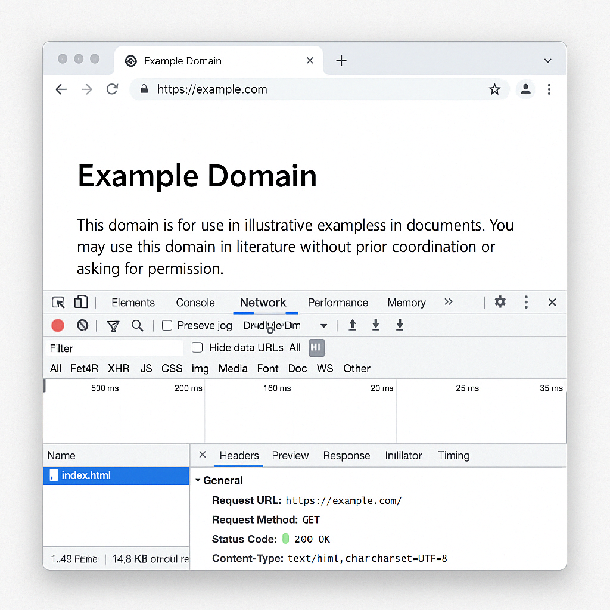

When a web page uses JavaScript to make requests to an [API](https://4geeks.com/es/lesson/comprendiendo-rest-apis?search=api), things don't always go perfectly. Network errors, incomplete responses, or server issues can occur. Fortunately, modern browsers provide **developer tools** that allow us to **see what's happening behind the scenes**, what requests are being sent, what responses are received, and how long they take.

Learning to use these tools is **key to understanding, detecting, and solving problems** when working with [APIs](https://4geeks.com/es/lesson/comprendiendo-rest-apis?search=api).

### How to view and analyze every request from your application?

In most browsers (like Chrome, Firefox, or Edge), you can open the **developer tools** by pressing: `F12` or right-click ➔ **"Inspect"** ➔ **"Network"** tab. The **Network** tab shows in real-time every request the page makes, the type of request (GET, POST, etc.), the response status (200, 404, 500...), the response size, and the time it took.

Imagine you're a chef, and something goes wrong in the kitchen—a dish is incomplete or poorly served. Without tools, you can only guess what went wrong, but with inspection tools, you can see the entire order, the ingredients, the cooking time, and even if the waiter forgot something. The browser's **"Network"** tab is like a camera that **records every step of the order** so you can see what happened in case of issues.

The image shows several tabs to explore:

- **Headers**: displays the headers sent and received.
- **Preview**: a preview of how the data would look.
- **Response**: shows the actual content of the response (e.g., a complete JSON). The **Response** tab is very useful to see what data actually arrived and analyze if the content is as expected.
- **Timing**: shows how long it took to complete.

In the **Headers** tab, you can see details like the requested URL, the HTTP method used (GET, POST, PUT, DELETE), and the status code to know if the request was successful (`200 OK`) or if there was an error (`404 Not Found`, `500 Internal Server Error`, etc.). It's important to note that in the browser's **Network** tab, not all requests come from JavaScript. Some are automatic, like loading images, stylesheets, or scripts. Use the filters **("XHR" or "Fetch")** to see only the requests dynamically made by your code, such as `fetch()` or `XMLHttpRequest`.

> 💡 Keep in mind that although all modern browsers (Chrome, Firefox, Edge, Safari) offer very similar inspection tools, there may be **small differences in the names or layout of the tabs**. However, the concepts you learned here apply in all cases.

The browser's **Developer Tools Inspector** is one of the most powerful allies you'll have as a web developer. Within it, the **"Network"** tab allows you to see, understand, and fix how data travels between your page and the servers.

Now that you know this tool, we invite you to open any website, explore the inspector, go to the **Network** tab, and observe what requests are made, what data arrives, and what errors might appear.

## Ready to Prove You See the Web Like a Pro? 😎

Answer these questions to test what you've learned about debugging API requests in the browser:

**Which of the following options best describes what you see in the "Network" tab of the Inspector?**
- [ ] The graphical elements and their styles.
- [ ] The HTTP requests made by the page and their responses.
- [ ] The JavaScript errors in the code.
- [ ] The hierarchical structure of the HTML.

**What type of requests should you filter if you want to see those made dynamically by JavaScript?**
- [ ] Document
- [ ] Img
- [ ] XHR or Fetch
- [ ] Stylesheet

**Where can you see the actual content (e.g., a JSON) that the server responded with?**
- [ ] In the Headers tab.
- [ ] In the Preview tab.
- [ ] In the Response tab.
- [ ] In the Timing tab.

**If you see a `404 Not Found` error in a request, what does it mean?**
- [ ] That the server took too long to respond.
- [ ] That the requested URL does not exist on the server.
- [ ] That the browser blocked the request.
- [ ] That the data arrived incomplete.

**Which of the following statements is correct?**
- [ ] All the requests you see in the Network tab are manually made by JavaScript.
- [ ] Only XHR or Fetch requests are usually initiated by JavaScript.
- [ ] The "Network" tab only shows network errors.
- [ ] The "Console" tab is used to view HTTP requests.
