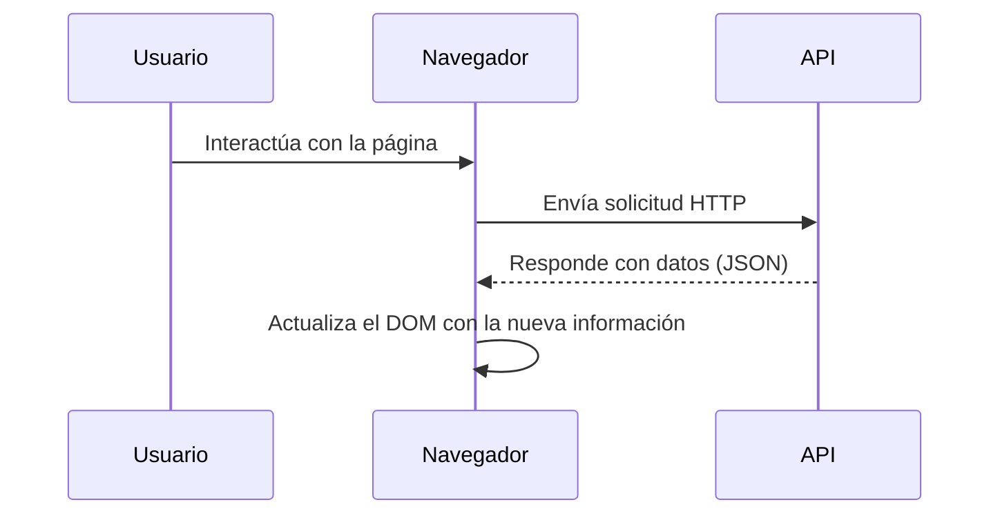

Antes, navegar por Internet era un poco más lento de lo que estamos acostumbrados hoy. Cada vez que queríamos ver una nueva página o sección, el navegador tenía que hacer toda una solicitud al servidor, esperar la respuesta y volver a cargar todo desde cero. Era como reiniciar el mundo digital cada vez que querías un pequeño cambio.

Hoy en día, las cosas son muy distintas. Gracias a JavaScript, los sitios modernos pueden hacer **solicitudes en segundo plano** para traer solo la información que necesitan. Esto permite **actualizar partes específicas de la página**, como un listado de noticias, un precio en tiempo real o una lista de comentarios, sin tener que recargar todo el sitio.

### ¿Cómo JavaScript consigue actualizar la página sin recargarla?

JavaScript puede hacer **solicitudes [HTTP](https://4geeks.com/es/lesson/que-es-http?search=http) adicionales** mientras la página ya está cargada. Esto se hace normalmente con funciones como:

- [`fetch()`](https://4geeks.com/es/lesson/la-api-fetch-de-javascript?search=fetch) → moderna y simple
- `XMLHttpRequest` → más antigua

Con esas funciones, el navegador puede **pedir datos a una [API](https://4geeks.com/es/lesson/comprendiendo-rest-apis?search=api)** (otro servidor o ruta), y cuando los recibe, **actualiza el contenido del HTML directamente**. Es como estar en un restaurante en el que ya estás sentado y comiendo. Si quieres algo más, el camarero **va directamente a la cocina** y trae solo eso, no es necesario que salgas, vuelvas y entres a pedir todo otra vez.

Entonces, JavaScript actúa como ese camarero: **trae solo lo que necesitas, cuando lo necesitas**.

### ¿Qué recibe exactamente mi página al hacer una solicitud?

Cuando JavaScript hace una solicitud para actualizar parte de la página, no recibe una página HTML completa como antes. En cambio, recibe **datos ligeros y fáciles de procesar**, en formatos como:

- **`JSON`**: Es el formato más común. Representa datos de manera simple y compacta, ideal para que JavaScript los lea fácilmente.
- **`XML`**: Una forma más antigua y compleja de estructurar datos, hoy en desuso para la mayoría de los casos web.
- **Fragmentos de `HTML` o texto plano**: A veces el servidor manda directamente el contenido listo para insertarlo en la página.

Por ejemplo, piensa en un sitio de noticias que actualiza los titulares cada minuto sin recargar, lo que sucede es lo siguiente:

1. La página carga normalmente.
2. JavaScript hace una solicitud a una [API](https://4geeks.com/es/lesson/comprendiendo-rest-apis?search=api) como `/api/titulares`.
3. El servidor responde con un JSON con los nuevos titulares.
4. JavaScript modifica el DOM para mostrar las noticias nuevas.

Ahora bien, ¿Qué pasa si algo falla? A veces la solicitud puede fallar. Hay varios motivos por los cuales esa solicitud podría fallar. Por ejemplo: El servidor está caído o no responde, la red del usuario está lenta o desconectada, hay un error en la URL de la solicitud o el servidor responde, pero devuelve un error (como un 404 o un 500).

Estas situaciones son normales en Internet, por eso el navegador y JavaScript deben estar preparados para manejarlas de manera inteligente. Algunas formas de manejarlo cuando se detecta un problema, seria: 

- **Mostrar un mensaje de error claro:** por ejemplo, "No pudimos cargar los últimos titulares. Intenta nuevamente."
- **Intentar reintentar la solicitud:** algunas aplicaciones intentan pedir los datos otra vez después de unos segundos.
- **Mostrar contenido alternativo:** como una tarjeta vacía o un mensaje genérico en lugar de dejar la página en blanco.
- **Registrar el error:** para que los desarrolladores puedan analizarlo después y mejorar la aplicación.

Así, aunque algo salga mal, la experiencia del usuario no se rompe completamente. Es por esto que las actualizaciones dinámicas con JavaScript, es una de las claves del desarrollo web moderno, ya que nos dan sitios más rápidos, más fluidos, y con una experiencia mucho más natural para el usuario.