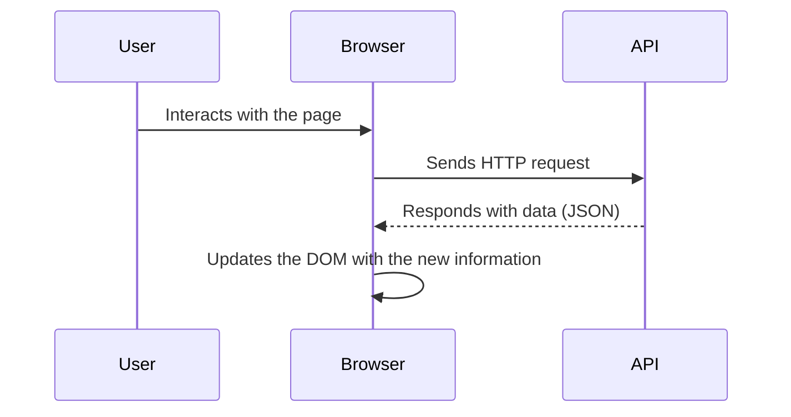

In the past, browsing the internet was a bit slower than what we are used to today. Every time we wanted to view a new page or section, the browser had to make a full request to the server, wait for the response, and reload everything from scratch. It was like restarting the digital world every time you wanted a small change.

Nowadays, things are very different. Thanks to JavaScript, modern websites can make **background requests** to fetch only the information they need. This allows **specific parts of the page** to be updated, such as a news feed, real-time pricing, or a list of comments, without reloading the entire site.

### How Does JavaScript Update the Page Without Reloading It?

JavaScript can make **additional [HTTP](https://4geeks.com/lesson/what-is-http) requests** while the page is already loaded. This is typically done using functions like:

- [`fetch()`](https://4geeks.com/lesson/the-fetch-javascript-api) → modern and simple
- `XMLHttpRequest` → older method

With these functions, the browser can **request data from an [API](https://4geeks.com/lesson/understanding-rest-apis)** (another server or endpoint), and when it receives the data, **it updates the HTML content directly**. It’s like being in a restaurant where you’re already seated and eating. If you want something else, the waiter **goes directly to the kitchen** and brings just that, without you having to leave, come back, and order everything again.

So, JavaScript acts like that waiter: **it brings only what you need, when you need it**.

### What Exactly Does My Page Receive When Making a Request?

When JavaScript makes a request to update part of the page, it doesn’t receive a full HTML page like before. Instead, it receives **lightweight and easy-to-process data**, in formats such as:

- **`JSON`**: The most common format. It represents data in a simple and compact way, ideal for JavaScript to read easily.
- **`XML`**: An older and more complex way to structure data, now mostly outdated for web use.
- **HTML fragments or plain text**: Sometimes the server sends content ready to be inserted directly into the page.

For example, think of a news site that updates headlines every minute without reloading. Here’s what happens:

1. The page loads normally.
2. JavaScript makes a request to an [API](https://4geeks.com/lesson/understanding-rest-apis) like `/api/headlines`.
3. The server responds with a JSON containing the new headlines.
4. JavaScript modifies the DOM to display the new news items.

Now, what happens if something goes wrong? Sometimes the request can fail. There are several reasons why this might happen, such as: The server is down or unresponsive, the user’s network is slow or disconnected, there’s an error in the request URL, or the server responds but returns an error (like a 404 or 500).

These situations are normal on the internet, so the browser and JavaScript must be prepared to handle them intelligently. Some ways to handle issues when a problem is detected include:

- **Displaying a clear error message:** for example, "We couldn’t load the latest headlines. Please try again."
- **Retrying the request:** some applications attempt to fetch the data again after a few seconds.
- **Showing alternative content:** such as an empty card or a generic message instead of leaving the page blank.
- **Logging the error:** so developers can analyze it later and improve the application.

This way, even if something goes wrong, the user experience isn’t completely broken. This is why dynamic updates with JavaScript are one of the keys to modern web development, as they provide faster, smoother websites with a much more natural user experience.