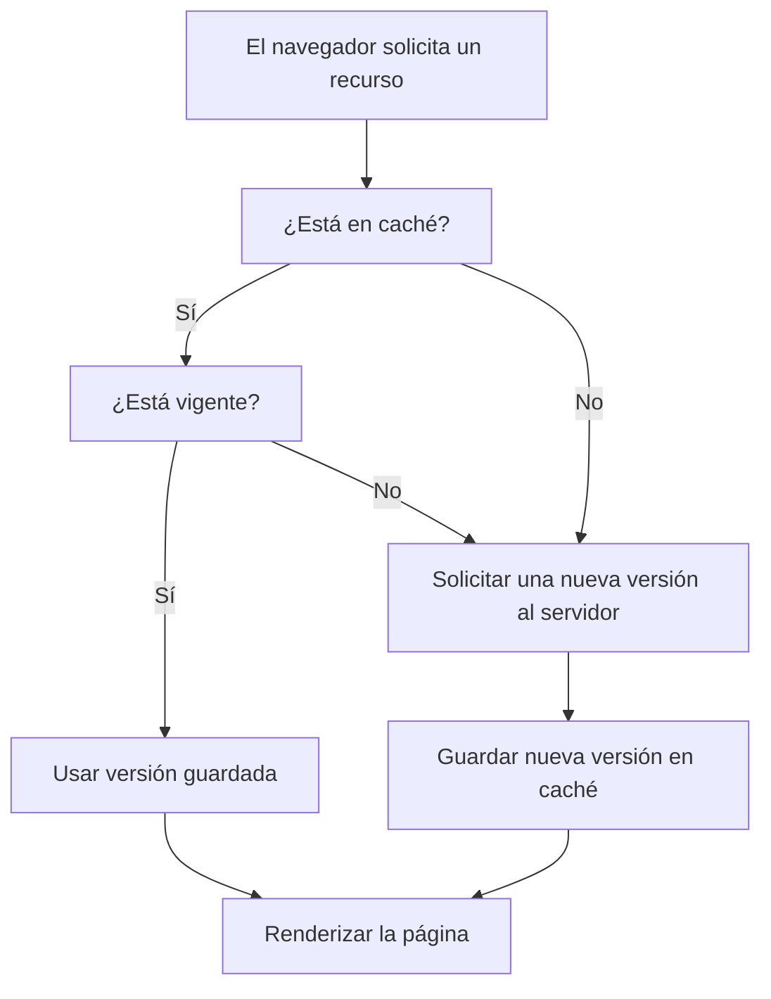

## 📘 Capítulo 7: Optimizando la Carga de la Página – Guardar para ir más rápido

Hasta ahora vimos cómo el navegador carga una página solicitando recursos como hojas de estilo, scripts, imágenes y más. Pero, ¿qué pasa si volvés a visitar la misma página al rato?

La respuesta es clave para el rendimiento web: **el navegador intenta no volver a descargar lo mismo dos veces**. En su lugar, **usa memoria caché** para guardar archivos temporalmente y acelerar las siguientes visitas.

---

### 🧠 ¿Qué es la caché?

La **caché del navegador** es un espacio donde se almacenan copias de archivos que ya fueron descargados, como:

- Imágenes
- Archivos CSS
- Scripts JavaScript
- Fuentes
- Incluso páginas HTML

Si el navegador detecta que tiene una copia válida, **la usa directamente desde el almacenamiento local** sin hacer una nueva solicitud al servidor.

Esto hace que la carga de la página sea **mucho más rápida** y reduce el uso de ancho de banda.

---

### 📦 ¿Qué se guarda y por cuánto tiempo?

El servidor puede indicar si un archivo puede ser guardado, y por cuánto tiempo, usando **encabezados de caché HTTP**, como:

- `Cache-Control: max-age=3600` → Guardar por 1 hora
- `Expires: [fecha]` → Hasta cuándo es válido
- `ETag: [identificador]` → Permite validar si cambió

---

### ⚠️ ¿Cuándo puede causar problemas?

La caché es muy útil, pero también puede confundir durante el desarrollo de un sitio:

- Si modificás un archivo, pero el navegador usa una copia vieja de la caché, no verás los cambios.
- Esto puede hacer que “parezca” que el sitio no responde o tiene errores antiguos.

#### 💡 Soluciones para desarrolladores:
- Usar el modo “vaciar caché” o “forzar recarga” en el navegador.
- Desactivar la caché temporalmente en las herramientas de desarrollo.
- Versionar archivos (por ejemplo, `style.v2.css`) para que el navegador detecte el cambio.

---

### 🍽️ Analogía: la despensa del chef

Imaginá que el navegador es como un chef que guarda ingredientes en una despensa.

- Si alguien pide un plato y ya tiene los ingredientes, los usa al instante.
- Si no los tiene, tiene que ir a comprarlos (hacer una nueva solicitud).
- Pero si los ingredientes ya están vencidos (caché expirada), **debe actualizarlos** antes de cocinar.

---

