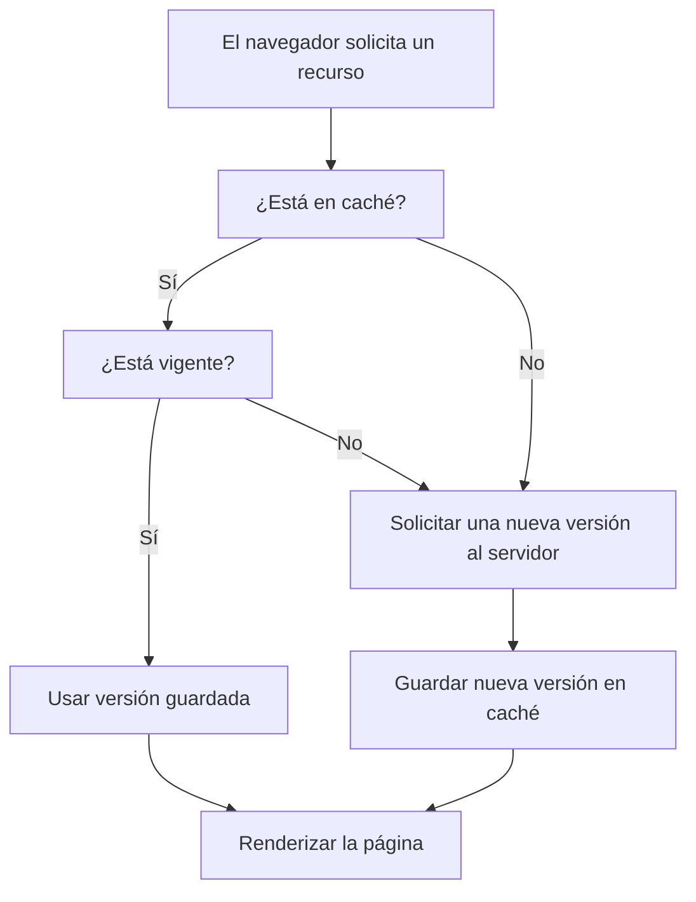

Hasta ahora vimos cómo el navegador carga una página solicitando recursos como hojas de estilo, scripts, imágenes y más. Pero, ¿qué pasa si volvés a visitar la misma página al rato?

La respuesta es clave para el rendimiento web: **el navegador intenta no volver a descargar lo mismo dos veces**. En su lugar, **usa memoria caché** para guardar archivos temporalmente y acelerar las siguientes visitas.

### La caché es como una despensa en casa

Imagina que el navegador es como una persona que cocina todos los días. Cuando necesita preparar una comida, lo primero que hace es mirar en la despensa (la caché). Si ya tiene los ingredientes (archivos descargados antes), puede cocinar más rápido sin salir de casa. Pero si le falta algo, tiene que ir al supermercado (el servidor) a comprarlo, lo cual toma más tiempo.

A veces, un ingrediente en la despensa ya está vencido (la caché expiró), así que hay que reemplazarlo por uno nuevo. Y si es la primera vez que va a cocinar ese plato, tendrá que conseguir todo desde cero.

Entonces si el navegador detecta que tiene información válida a disposición, **la usa directamente desde el almacenamiento local** sin hacer una nueva solicitud al servidor. Esto hace que la carga de la página sea **mucho más rápida** y reduce el uso de ancho de banda.

###  ¿Qué se guarda y por cuánto tiempo?

Cuando el navegador visita una página, puede guardar algunos archivos (como imágenes, hojas de estilo o scripts) para no tener que volver a descargarlos la próxima vez. Pero, ¿cómo sabe **si puede guardarlos** y **por cuánto tiempo**?

El servidor le deja instrucciones especiales llamadas **encabezados de caché**, que funcionan como notas para el navegador:

- `Cache-Control: max-age=3600` → “Guardalo por 1 hora”  
- `Expires: [fecha]` → “Guardalo hasta esta fecha específica”
- `ETag: [identificador]` → “Si tenés dudas, preguntame si cambió”

Así, el navegador puede decidir **cuándo usar lo que ya tiene** y **cuándo pedir una versión nueva** al servidor.

###  ¿Cuándo puede causar problemas?

Aunque la caché es muy útil para acelerar la carga de los sitios, también puede causar confusión, especialmente cuando estás haciendo cambios durante el desarrollo de una página.

Por ejemplo:

- Si modificás un archivo (como un CSS), pero el navegador sigue usando la copia antigua que tiene guardada en la caché, **no vas a ver tus cambios reflejados**.
- Esto puede hacer que parezca que el sitio está roto o que no responde bien, aunque tu código esté actualizado.

### ¿Qué podés hacer como desarrollador?

- **Forzar la recarga sin caché** (por ejemplo, con `Ctrl + F5`) para que el navegador descargue todo de nuevo.
- **Desactivar la caché** temporalmente desde las herramientas de desarrollo del navegador.

Como desarrollador o usuario, entender cómo funciona la caché te ayuda a diagnosticar errores, evitar confusiones y optimizar el rendimiento de cualquier sitio.

<todo> 
- COmo detectar en el network tab si un ceruso esta cachado (304?)
- El truco de limpiar un request cambiando el URL pero sin cambiar el path, por ejemplo, usando tokens como querystring params que no tienen impactor en la respuest pero si en el request, estas egañando al server.
- Dar un par de ejemplos de problemas que pasan con cache al ser web devs y como resolverlos
</todo>
