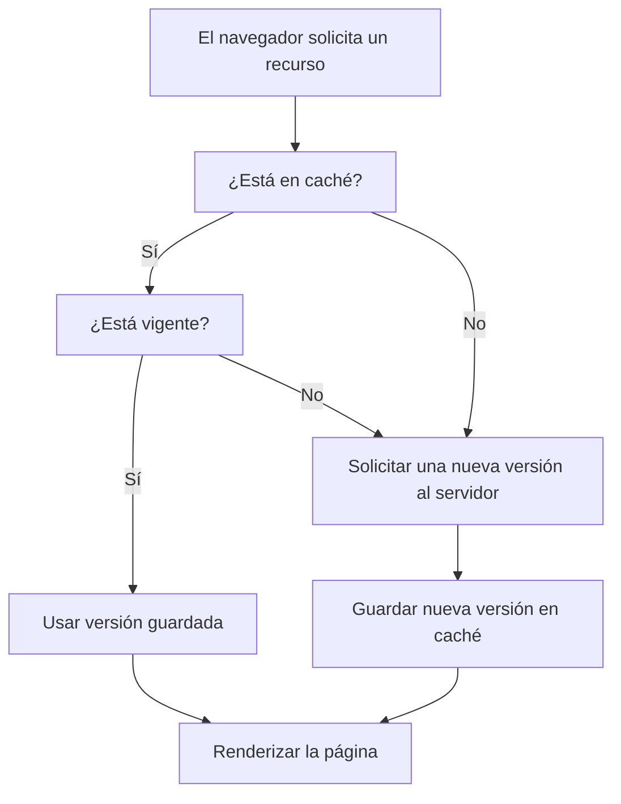

Hasta ahora vimos cómo el navegador carga una página solicitando recursos como hojas de estilo, scripts, imágenes y más. Pero, ¿qué pasa si volvés a visitar la misma página al rato?

La respuesta es clave para el rendimiento web: **el navegador intenta no volver a descargar lo mismo dos veces**. En su lugar, **usa memoria caché** para guardar archivos temporalmente y acelerar las siguientes visitas.


## La caché es como una despensa en casa

Imagina que el navegador es como una persona que cocina todos los días. Cuando necesita preparar una comida, lo primero que hace es mirar en la despensa (la caché). Si ya tiene los ingredientes (archivos descargados antes), puede cocinar más rápido sin salir de casa. Pero si le falta algo, tiene que ir al supermercado (el servidor) a comprarlo, lo cual toma más tiempo.

A veces, un ingrediente en la despensa ya está vencido (la caché expiró), así que hay que reemplazarlo por uno nuevo. Y si es la primera vez que va a cocinar ese plato, tendrá que conseguir todo desde cero.

Entonces si el navegador detecta que tiene información válida a disposición, **la usa directamente desde el almacenamiento local** sin hacer una nueva solicitud al servidor. Esto hace que la carga de la página sea **mucho más rápida** y reduce el uso de ancho de banda.


###  ¿Qué se guarda y por cuánto tiempo?

Cuando el navegador visita una página, puede guardar algunos archivos (como imágenes, hojas de estilo o scripts) para no tener que volver a descargarlos la próxima vez. Pero, ¿cómo sabe **si puede guardarlos** y **por cuánto tiempo**?

El servidor le deja instrucciones especiales llamadas **encabezados de caché**, que funcionan como notas para el navegador:

- `Cache-Control: max-age=3600` → “Guardalo por 1 hora”  
- `Expires: [fecha]` → “Guardalo hasta esta fecha específica”
- `ETag: [identificador]` → “Si tenés dudas, preguntame si cambió”

Así, el navegador puede decidir **cuándo usar lo que ya tiene** y **cuándo pedir una versión nueva** al servidor.

###  ¿Cuándo puede causar problemas?

Aunque la caché es muy útil para acelerar la carga de los sitios, también puede causar confusión, especialmente cuando estás haciendo cambios durante el desarrollo de una página.

Por ejemplo:

- Si modificás un archivo (como un CSS), pero el navegador sigue usando la copia antigua que tiene guardada en la caché, **no vas a ver tus cambios reflejados**.
- Esto puede hacer que parezca que el sitio está roto o que no responde bien, aunque tu código esté actualizado.

### ¿Qué podés hacer como desarrollador?

- **Forzar la recarga sin caché** (por ejemplo, con `Ctrl + F5`) para que el navegador descargue todo de nuevo.
- **Desactivar la caché** temporalmente desde las herramientas de desarrollo del navegador.

Como desarrollador o usuario, entender cómo funciona la caché te ayuda a diagnosticar errores, evitar confusiones y optimizar el rendimiento de cualquier sitio.



## Cómo detectar si un recurso fue servido desde caché

Cuando usás las herramientas de desarrollo del navegador (DevTools), podés inspeccionar las solicitudes en la pestaña **Network**. Algunos indicadores de que un recurso fue servido desde caché son:

- **Código de estado 304 Not Modified:** Esto significa que el navegador preguntó al servidor si el recurso había cambiado, y el servidor respondió que no, así que el navegador usó su copia local.

- **Indicadores como "from disk cache" o "from memory cache" en la columna Size o en los detalles de la solicitud:** Esto indica que el navegador **ni siquiera consultó al servidor** porque ya tenía una copia válida en memoria o en disco.

> **Nota:** En las DevTools de Chrome, podés agregar columnas como **"Transferred"** y **"Size"** para ver si un recurso se descargó realmente o vino desde caché.


## El truco de limpiar un recurso usando query strings

A veces queremos forzar que el navegador trate un recurso como **nuevo**, aunque la ruta del archivo no haya cambiado. Una estrategia común es **agregar un parámetro extra** en la URL que no afecta el contenido. Por ejemplo:

```html
<link rel="stylesheet" href="styles.css?v=2">
<script src="app.js?version=20240427"></script>
```

Aquí, aunque el servidor esté sirviendo el mismo archivo `styles.css` o `app.js`, el navegador ve una URL diferente (`styles.css?v=2`) y hace una nueva solicitud como si fuera otro recurso.

Esto es útil para:

- Asegurar que los usuarios descarguen la última versión de un archivo actualizado.
- Evitar problemas de caché agresiva en navegadores o proxies intermedios.

> **Importante:** Estos parámetros deben ser controlados estratégicamente: podés automatizarlos en el proceso de despliegue (build) para agregar un número de versión o hash cuando un archivo cambia.


### Ejemplos reales de problemas de caché y cómo solucionarlos

Aquí algunos casos típicos que enfrentan los desarrolladores web:

- **Cambio en el CSS o en un archivo JS pero los usuarios ven la versión vieja:** Solución: usar un query string de versión (`?v=2`) o cambiar el nombre del archivo (`styles_v2.css`).

- **Bug reportado donde "a mí se me ve roto pero a otro no":** Puede ser que uno esté viendo la versión vieja en caché.  
  Solución: forzar recarga sin caché (`Ctrl + F5`) o limpiar caché manualmente.

- **Analytics o scripts de terceros no se actualizan aunque cambiamos la integración:**  
  Solución: agregar control de versiones en las URLs de esos scripts.

- **Cambiaste una imagen, pero los usuarios siguen viendo la anterior:**  
  Solución: cambiar el nombre de la imagen (`logo_v2.png`) o agregar un query string (`logo.png?updated=1`).

- **Cambios menores en HTML no se reflejan en sitios con service workers (PWA):**  
  Solución: invalidar cachés en el service worker y asegurarse de gestionar la actualización correctamente.
