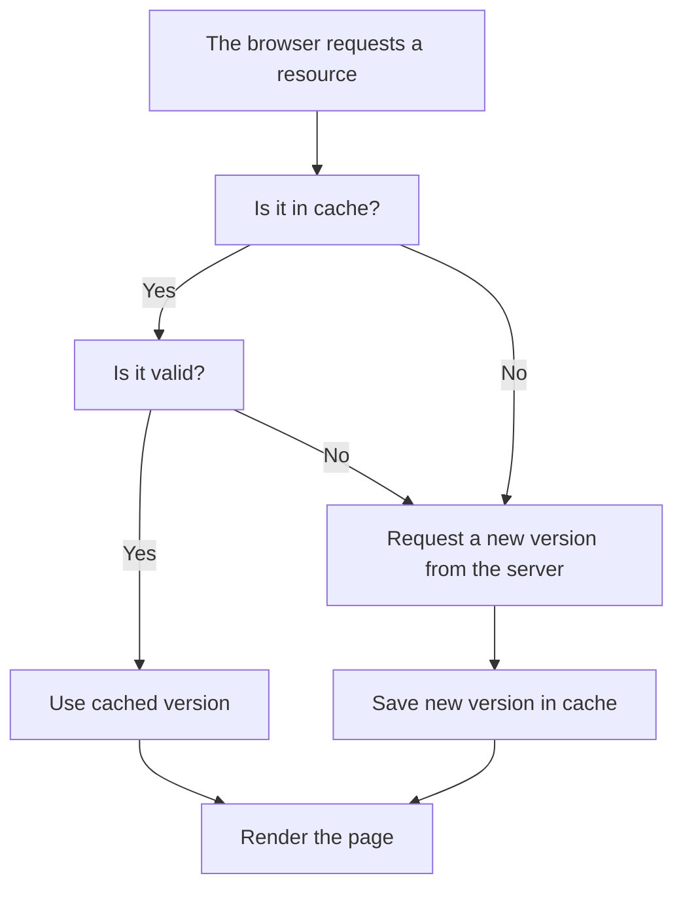

So far, we've seen how the browser loads a page by requesting resources like stylesheets, scripts, images, and more. But what happens if you revisit the same page later?

The answer is key to web performance: **the browser tries not to download the same thing twice**. Instead, it **uses cache** to temporarily store files and speed up subsequent visits.

### Cache is like a pantry at home

Imagine the browser as a person who cooks every day. When they need to prepare a meal, the first thing they do is check the pantry (the cache). If they already have the ingredients (previously downloaded files), they can cook faster without leaving the house. But if something is missing, they have to go to the store (the server) to buy it, which takes more time.

Sometimes, an ingredient in the pantry is expired (the cache has expired), so it needs to be replaced with a new one. And if it's the first time cooking that dish, they'll need to get everything from scratch.

So if the browser detects that it has valid information available, **it uses it directly from local storage** without making a new request to the server. This makes page loading **much faster** and reduces bandwidth usage.

### What gets stored and for how long?

When the browser visits a page, it can save some files (like images, stylesheets, or scripts) to avoid downloading them again next time. But how does it know **if it can save them** and **for how long**?

The server provides special instructions called **cache headers**, which act as notes for the browser:

- `Cache-Control: max-age=3600` → “Save it for 1 hour”  
- `Expires: [date]` → “Save it until this specific date”  
- `ETag: [identifier]` → “If in doubt, ask me if it has changed”

This way, the browser can decide **when to use what it already has** and **when to request a new version** from the server.

### When can it cause problems?

Although caching is very useful for speeding up site loading, it can also cause confusion, especially when you're making changes during the development of a page.

For example:

- If you modify a file (like a CSS file), but the browser keeps using the old copy stored in the cache, **you won't see your changes reflected**.
- This can make it seem like the site is broken or unresponsive, even though your code is up to date.

### What can you do as a developer?

- **Force a reload without cache** (e.g., with `Ctrl + F5`) so the browser downloads everything again.
- **Disable the cache** temporarily from the browser's developer tools.

As a developer or user, understanding how caching works helps you diagnose errors, avoid confusion, and optimize the performance of any site.

