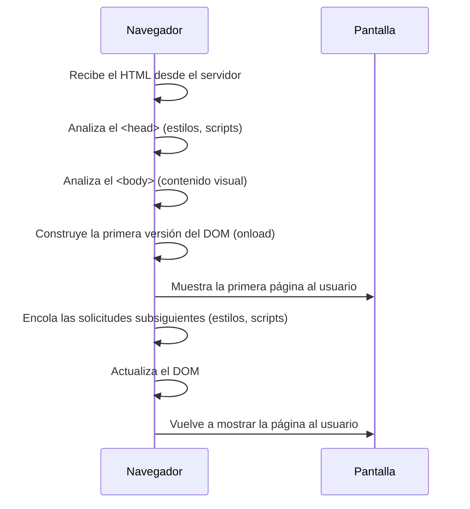

Antes de empezar, pongámonos en contexto, [**asumimos que ya sabes cómo un servidor procesa una solicitud**]((https://github.com/4GeeksAcademy/mastering-web-dynamics-from-HTTP-to-real-time/blob/main/lessons/response-to-the-client.es.md)) y prepara la primera respuesta HTML que se enviará al navegador. Ahora damos el siguiente paso: **¿qué sucede una vez que ese HTML llega al navegador?**  

Eso es lo que vamos a descubrir, cómo el navegador interpreta el documento para construir la página que ves en tu pantalla.

## El navegador como arquitecto

Una vez que el servidor envía **la respuesta** con el contenido de la página (por ejemplo, un archivo HTML), el navegador comienza su trabajo, recibiendo ese contenido y lo **analiza línea por línea para construir la estructura visual de la página** que vas a ver en tu pantalla. 

Imagina que el navegador es un arquitecto que recibe los planos de una casa (el HTML). Lee las instrucciones desde el inicio, interpreta las partes clave (estructura, decoración, funciones), y va montando cada elemento en su lugar. Si los planos tienen adjuntos como imágenes, manuales técnicos o permisos (hojas de estilo o scripts), el arquitecto necesita revisarlos antes de seguir.

Este paso se conoce como **análisis del HTML**, y da origen a una estructura interna llamada **DOM** (Modelo de Objeto del Documento), que es esencial para cualquier página web.

### DOM: la estructura invisible de cada página

El DOM es una representación en forma de árbol de todos los elementos HTML que componen la página. Por ejemplo, un archivo como este:

```html
<html>
  <head><title>Mi sitio</title></head>
  <body><h1>Bienvenido</h1><p>Hola mundo</p></body>
</html>
```

Se transforma en algo así dentro del navegador:

```css
html
├── head
│   └── title
└── body
    ├── h1
    └── p
```

El navegador **construye este árbol mientras analiza el HTML**, y luego lo utiliza para mostrar visualmente la página.


### ¿Cómo lo analiza?

1. Empieza por el `<html>` y baja línea por línea.

2. Lee primero el `<head>`, donde suele encontrar:

    - Títulos (`<title>`)

    - Hojas de estilo (`<link>`)

    - Scripts (`<script>`)

Luego pasa al `<body>`, que contiene lo que se verá en pantalla: texto, imágenes, botones, etc.

### ¿Qué puede bloquear el análisis?

Hay cosas que pueden detener o retrasar el proceso:

- Hojas de estilo externas (`<link rel="stylesheet">`): El navegador no sigue analizando hasta descargarlas, porque afectan el diseño.
- Scripts sin atributo `defer` o `async`: Si encuentra un `<script>` tradicional, lo ejecuta antes de seguir leyendo, lo que puede frenar el análisis general. Si agregas un `<script>` directamente en el `<head>` y no usas `defer` o `async`, el navegador frena el análisis de todo el documento y espera a descargar y ejecutar el script antes de continuar leyendo el HTML. Esto puede hacer que la carga visual de la página se vuelva más lenta, especialmente si el script tarda mucho en ejecutarse.

> 💡 Por eso es tan importante optimizar el orden en que se cargan recursos, para que el navegador pueda construir la página lo más rápido posible.


### ¿Qué pasa con imágenes o videos pesados?

Los archivos grandes como imágenes de alta resolución o videos, no bloquean el análisis del HTML ni la construcción inicial del DOM. Pero, pueden retrasar la carga visual total de la página (el renderizado completo). Esto significa que aunque el navegador termine de analizar y construir el DOM rápidamente, el usuario puede experimentar una página incompleta o en construcción si las imágenes o los videos aún no se cargaron.

Una forma de solucionar esto, es usar formatos comprimidos (.webp para imágenes, .mp4 para videos) y carga imágenes grandes de manera diferida usando `loading="lazy"` en las etiquetas ``.



Asumiendo que recibimos un HTML estático y no hay solicitudes subsiguientes (como nuevas descargas de recursos), el DOM básico se construye casi de inmediato. Sin embargo, HTMLs muy grandes (con miles de elementos) pueden ralentizar la visualización. Este problema no es del DOM en sí, sino de la capacidad de renderizado visual del navegador (pintar los píxeles en pantalla).

En resumen:

- DOM pequeño ➔ render instantáneo.
- DOM gigante ➔ análisis rápido, pero visualización lenta.


