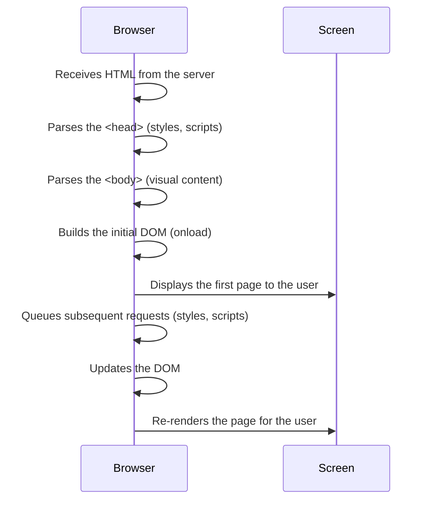

Before we begin, let’s set the context: [**we assume you already know how a server processes a request**](#response-to-the-client.md) and prepares the initial HTML response to be sent to the browser. Now we take the next step: **what happens once that HTML reaches the browser?**

That’s what we’re going to uncover—how the browser interprets the document to build the page you see on your screen.

## The Browser as an Architect

Once the server sends **the response** with the page content (e.g., an HTML file), the browser begins its work, receiving that content and **parsing it line by line to construct the visual structure of the page** you’ll see on your screen.

Imagine the browser as an architect receiving the blueprints of a house (the HTML). It reads the instructions from the beginning, interprets the key parts (structure, decoration, functions), and assembles each element in its place. If the blueprints have attachments like images, technical manuals, or permits (stylesheets or scripts), the architect needs to review them before proceeding.

This step is known as **HTML parsing**, and it gives rise to an internal structure called the **DOM** (Document Object Model), which is essential for any web page.

### DOM: The Invisible Structure of Every Page

The DOM is a tree-like representation of all the HTML elements that make up the page. For example, a file like this:

```html
<html>
    <head><title>My Site</title></head>
    <body><h1>Welcome</h1><p>Hello World</p></body>
</html>
```

Transforms into something like this inside the browser:

```css
html
├── head
│   └── title
└── body
        ├── h1
        └── p
```

The browser **builds this tree while parsing the HTML**, and then uses it to visually render the page.

### How Does It Parse?

1. It starts with `<html>` and goes line by line.

2. It first reads the `<head>`, where it usually finds:

    - Titles (`<title>`)

    - Stylesheets (`<link>`)

    - Scripts (`<script>`)

Then it moves to the `<body>`, which contains what will be displayed on the screen: text, images, buttons, etc.

### What Can Block Parsing?

Certain elements can stop or delay the process:

- External stylesheets (`<link rel="stylesheet">`): The browser pauses parsing until they are downloaded because they affect the design.
- Scripts without `defer` or `async` attributes: If it encounters a traditional `<script>`, it executes it before continuing, which can halt overall parsing. If you add a `<script>` directly in the `<head>` without using `defer` or `async`, the browser stops parsing the entire document and waits to download and execute the script before continuing to read the HTML. This can slow down the visual loading of the page, especially if the script takes a long time to execute.

> 💡 This is why optimizing the order in which resources are loaded is so important, so the browser can build the page as quickly as possible.

### What About Large Images or Videos?

Large files like high-resolution images or videos do not block HTML parsing or the initial DOM construction. However, they can delay the full visual load of the page (complete rendering). This means that even if the browser finishes parsing and building the DOM quickly, the user might experience an incomplete or "under construction" page if the images or videos haven’t loaded yet.

One way to address this is by using compressed formats (.webp for images, .mp4 for videos) and loading large images lazily using `loading="lazy"` in `` tags.



Assuming we receive static HTML with no subsequent requests (like additional resource downloads), the basic DOM is built almost immediately. However, very large HTML files (with thousands of elements) can slow down rendering. This issue isn’t with the DOM itself but with the browser’s visual rendering capacity (painting pixels on the screen).

In summary:

- Small DOM ➔ instant render.
- Large DOM ➔ fast parsing, but slow visualization.
