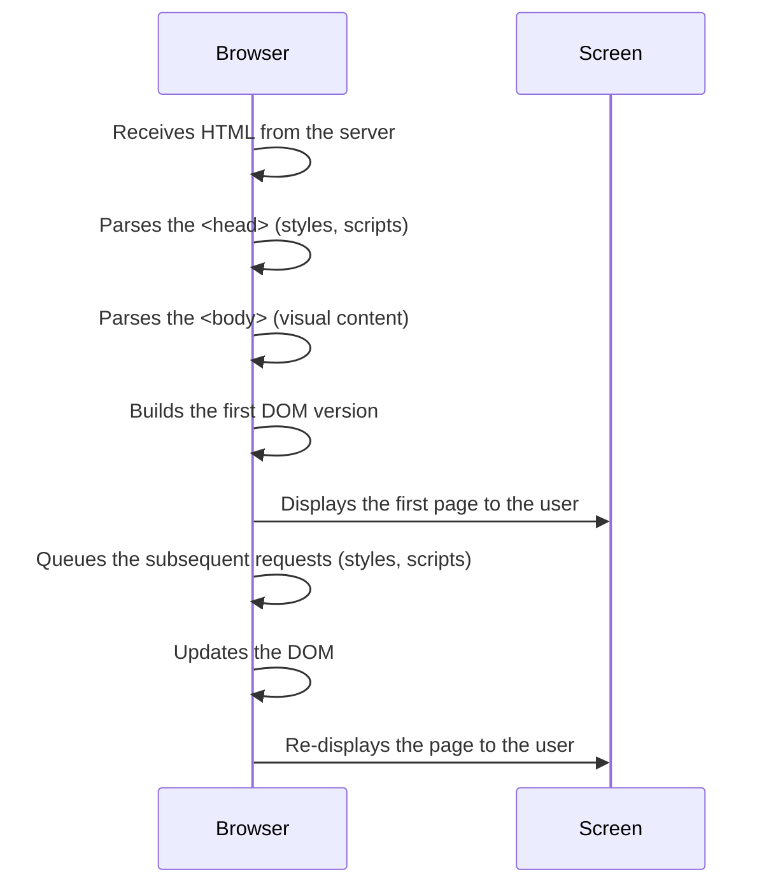

<todo> Falta la introduccion diciendo que asumimos que ya se sabe como funciona el backend y como recive y prepara la respuesta del primer HTML que va a renderizarse, ahora vamos a hablar de lo que pasa una vez que el HTML llega al browser</todo>

## The Browser as an Architect

Once the server sends **the response** with the page content (e.g., an HTML file), the browser begins its work, receiving that content and **parsing it line by line to build the visual structure of the page** you see on your screen.

Imagine the browser as an architect receiving the blueprints of a house (the HTML). It reads the instructions from the beginning, interprets the key parts (structure, decoration, functions), and assembles each element in its place. If the blueprints have attachments like images, technical manuals, or permits (stylesheets or scripts), the architect needs to review them before proceeding.

This step is known as **HTML parsing**, and it gives rise to an internal structure called the **DOM** (Document Object Model), which is essential for any web page.

### DOM: The Invisible Structure of Every Page

The DOM is a tree-like representation of all the HTML elements that make up the page. For example, a file like this:

```html
<html>
    <head><title>My Site</title></head>
    <body><h1>Welcome</h1><p>Hello World</p></body>
</html>
```

Transforms into something like this inside the browser:

```css
html
├── head
│   └── title
└── body
        ├── h1
        └── p
```

The browser **builds this tree while parsing the HTML**, and then uses it to visually render the page.

### How Does It Parse?

1. It starts with `<html>` and processes line by line.

2. It first reads the `<head>`, where it usually finds:

    - Titles (`<title>`)

    - Stylesheets (`<link>`)

    - Scripts (`<script>`)

Then it moves to the `<body>`, which contains what will be displayed on the screen: text, images, buttons, etc.

### What Can Block Parsing?

Certain elements can stop or delay the process:

- External stylesheets (`<link rel="stylesheet">`): The browser pauses parsing until they are downloaded because they affect the design.
- Scripts without `defer` or `async` attributes: If it encounters a traditional `<script>`, it executes it before continuing, which can slow down overall parsing.

> This is why optimizing the order in which resources are loaded is so important: to allow the browser to build the page as quickly as possible.


