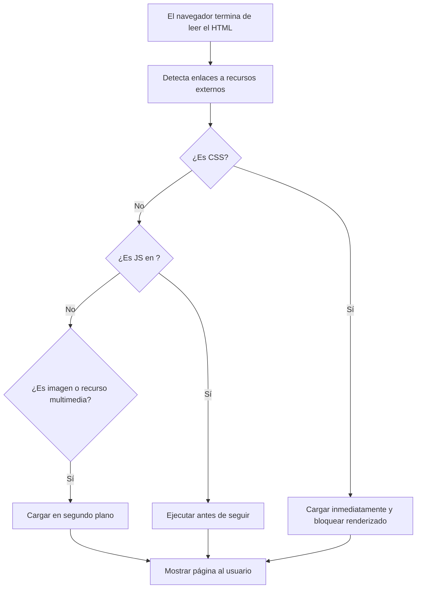

Una vez que el navegador ha terminado de analizar el HTML y construir el DOM, su trabajo aún no ha terminado. Ahora tiene que **cargar todos los recursos adicionales** mencionados en la página para que esta se vea y funcione correctamente. Estos recursos incluyen: Hojas de estilo (CSS), imágenes, scripts de JavaScript, fuentes personalizadas,videos u otros archivos multimedia.

La pregunta sería ¿los carga todos al mismo tiempo? ¿Qué pasa si hay muchos? Aquí es donde entra en juego la **priorización de recursos**.

El navegador detecta en el HTML distintas etiquetas que indican recursos externos:

- `<link>` → CSS
- `` → imágenes
- `<script>` → JavaScript
- `<video>`, `<audio>`, `<source>` → medios
- `@font-face` → fuentes personalizadas

Cada uno de estos recursos necesita una **solicitud adicional** para ser descargado. Pero el navegador no lo hace en cualquier orden, **prioriza lo que es esencial para mostrar la página correctamente**.

### ¿Qué se carga primero?

Los navegadores siguen ciertas reglas de prioridad:

1. **CSS primero:** Las hojas de estilo bloquean el renderizado de la página, ya que afectan cómo se ve. El navegador no muestra nada hasta que el CSS esté listo.

2. **JavaScript después del CSS:** Los scripts también pueden bloquear la visualización si están en el `<head>` y no se usa `defer` o `async`.

3. **Imágenes y otros recursos visuales:** Se cargan en segundo plano, una vez que el contenido principal ya está siendo procesado.

### ¿Por qué importa esta prioridad?

Porque **afecta directamente el tiempo de carga de la página**. Si el navegador espera mucho tiempo para cargar un recurso clave (como un CSS bloqueante o un script grande), el usuario verá una pantalla en blanco por más tiempo.

Saber esto te permite:

- Optimizar el orden del código HTML
- Usar atributos como `defer`, `async`, `loading="lazy"`
- Mejorar la experiencia de carga para tus usuarios

Si compararamos este proceso con una cocina profesional, seria algo como esto:

- El chef primero calienta la sartén (CSS).
- Luego empieza a preparar los ingredientes base (HTML + estructura visual).
- Mientras tanto, otras personas traen los ingredientes secundarios (imágenes, videos, scripts).
- Solo cuando todo está en su lugar, el plato se presenta.

El navegador funciona igual: **carga lo esencial primero, y lo decorativo después**.

