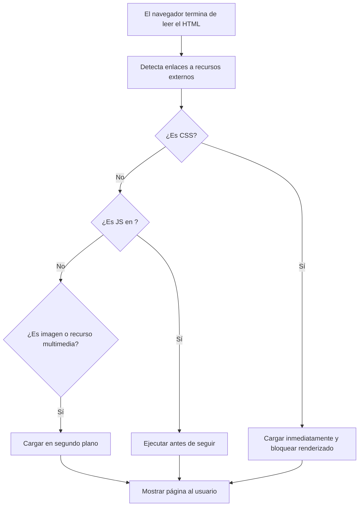

Esta lección no trata sobre [analizar HTML](#parsing-the-html.es.md) ni sobre el renderizado visual de un sitio web. Aquí queremos enfocarnos específicamente en **cómo el navegador gestiona las solicitudes HTTP de recursos externos** (como hojas de estilo, imágenes o scripts) después de construir el DOM. Comprender este proceso es **clave para diagnosticar y optimizar la carga de un sitio web**, especialmente cuando surgen problemas de rendimiento.

**Asumimos que ya sabes**:
- Qué es HTTP y cómo funcionan las solicitudes y respuestas básicas.
- Cómo se construye y se analiza el HTML de una página.

Ahora damos un paso más profundo: **¿qué pasa con todos esos recursos que el HTML referencia?** ¿El navegador los descarga todos al mismo tiempo? ¿Qué prioriza? ¿Qué puede bloquear la visualización?. ¡Vamos a descubrirlo!


Una vez que el navegador ha terminado de analizar el HTML y construir el DOM, su trabajo aún no ha terminado. Ahora tiene que **cargar todos los recursos adicionales** mencionados en la página para que esta se vea y funcione correctamente. Estos recursos incluyen: Hojas de estilo (CSS), imágenes, scripts de JavaScript, fuentes personalizadas,videos u otros archivos multimedia.

La pregunta sería ¿los carga todos al mismo tiempo? ¿Qué pasa si hay muchos? Aquí es donde entra en juego la **priorización de recursos**. El navegador detecta en el HTML distintas etiquetas que indican recursos externos:

- `<link>` → CSS
- `` → imágenes
- `<script>` → JavaScript
- `<video>`, `<audio>`, `<source>` → medios
- `@font-face` → fuentes personalizadas

Cada uno de estos recursos necesita una **solicitud adicional** para ser descargado. Pero el navegador no lo hace en cualquier orden, **prioriza lo que es esencial para mostrar la página correctamente**.


## ¿Qué se carga primero?

Los navegadores siguen ciertas reglas de prioridad:

1. **CSS primero:** Las hojas de estilo bloquean el renderizado de la página, ya que afectan cómo se ve. El navegador no muestra nada hasta que el CSS esté listo.

2. **JavaScript después del CSS:** Los scripts también pueden bloquear la visualización si están en el `<head>` y no se usa `defer` o `async`.

3. **Imágenes y otros recursos visuales:** Se cargan en segundo plano, una vez que el contenido principal ya está siendo procesado.


### ¿Qué pasa después de cargar todos los recursos? El evento onload

Cuando el navegador termina de cargar todos los recursos principales referenciados en la página (HTML, CSS, imágenes, scripts, fuentes, etc.), dispara un evento muy importante: el evento onload. Este evento indica que el DOM está completamente construido y que todos los recursos externos necesarios también están totalmente descargados.

En JavaScript, podemos usarlo así:

```javascript
window.onload = function() {
  console.log('La página completa se ha cargado');
  // Aquí es seguro manipular imágenes, estilos aplicados, etc.
};
```
> Nota: `onload` no es inmediato, ocurre después de que todo está descargado, incluyendo imágenes y videos.

Por eso no deberías usar `onload` para cosas que necesitan ejecutarse lo antes posible (por ejemplo, inicializar la interacción básica del usuario), sino más bien para tareas que dependen de que todo esté ya visible y disponible.

### ¿Qué pasa con async y defer?

Antes de que ocurra el evento `onload`, los navegadores ya manejan de forma inteligente cuándo cargar y ejecutar los scripts JavaScript.

- `async`: descarga el script en paralelo y lo ejecuta tan pronto como esté listo, sin esperar al resto del HTML. Esto puede hacer que la ejecución de scripts sea impredecible.

- `defer`: descarga el script en paralelo pero espera a que el HTML esté completamente parseado antes de ejecutarlo, sin bloquear el análisis del documento.

En otras palabras, `async` y `defer` ocurren antes que onload y ayudan a acelerar la construcción inicial de la página sin afectar la descarga final de todos los recursos. Así que entender `async`, `defer` y `onload` te da control sobre cuándo y cómo corre tu JavaScript en relación al proceso de carga de la página.


### ¿Por qué importa esta prioridad?

Porque **afecta directamente el tiempo de carga de la página**. Si el navegador espera mucho tiempo para cargar un recurso clave (como un CSS bloqueante o un script grande), el usuario verá una pantalla en blanco por más tiempo.

Saber esto te permite:

- Optimizar el orden del código HTML
- Usar atributos como `defer`, `async`, `loading="lazy"`
- Mejorar la experiencia de carga para tus usuarios


Si compararamos este proceso con una cocina profesional, seria algo como esto:

- El chef primero calienta la sartén (CSS).
- Luego empieza a preparar los ingredientes base (HTML + estructura visual).
- Mientras tanto, otras personas traen los ingredientes secundarios (imágenes, videos, scripts).
- Solo cuando todo está en su lugar, el plato se presenta.

El navegador funciona igual: **carga lo esencial primero, y lo decorativo después**.




## Above the Fold vs Below the Fold: optimizando la percepción de carga

En el mundo del rendimiento web, hay un concepto clave: **above the fold** y **below the fold**.

- **Above the fold** ("por encima del pliegue") se refiere a la parte de una página web que **el usuario ve inmediatamente** al cargar la página, **sin necesidad de hacer scroll**.
- **Below the fold** ("por debajo del pliegue") se refiere a todo lo que **requiere hacer scroll** para ser visible.

¿Por qué importa esta distinción? Porque el navegador y los desarrolladores pueden priorizar los recursos que afectan **primero** la parte visible (`above the fold`) para dar la sensación de que la página carga rápido, aunque todavía haya contenido descargándose más abajo.


### `loading="lazy"` y su relación con el fold

Para mejorar este comportamiento, existe un atributo muy útil en las imágenes: **`loading="lazy"`**. Cuando agregamos `loading="lazy"` a una imagen:

- El navegador **no descarga la imagen de inmediato**.
- **Solo descarga** la imagen cuando el usuario **se acerca** a ella haciendo scroll.

Esto es perfecto para imágenes que están **below the fold**, porque ahorra ancho de banda inicial, acelera la construcción del DOM visible, reduce el tiempo hasta que el usuario ve algo útil.

```html

```

> **Nota:** Imágenes **above the fold** **NO** deberían tener `loading="lazy"`, porque el usuario las necesita ver enseguida.


## ¿Deberíamos separar CSS y JavaScript?

Sí. Para lograr una carga más rápida, es una buena práctica:

- **Separar el CSS y el JavaScript** que es crítico para el contenido **above the fold**.
- Cargar el resto de los estilos y scripts de manera diferida (`async`, `defer`, o lazy-loaded).

Por ejemplo:

- **CSS crítico** (para el encabezado, menú, hero image) puede ir **inline** o en un pequeño archivo cargado inmediatamente.
- Scripts secundarios (como sliders, pop-ups, analytics) pueden diferirse o cargarse después que el usuario interactúe.

Esta estrategia ayuda a que el usuario vea y use el sitio **mucho más rápido**, incluso si la carga total de la página aún no ha terminado.


### Casos reales de debugging donde entender esto ayuda

Estos conceptos son fundamentales para identificar y resolver problemas de carga lenta:

- **Pantallas en blanco por varios segundos:** Puede deberse a CSS bloqueante o imágenes críticas con `loading="lazy"` aplicado erróneamente.

- **Tiempo hasta primer render muy alto (TTFB bajo, pero pantalla vacía):** Suele indicar problemas con el orden de carga de CSS o JavaScript.

- **Scroll "congelado" o cargando lentamente:** Probablemente hay demasiados recursos pesados `below the fold` que no están optimizados o no usan carga diferida.

- **Imágenes visibles que aparecen tarde o nunca:** Es posible que tengan `loading="lazy"` pero estén **above the fold** (mal uso del lazy-loading).

- **Renderizado visible correcto pero fallos funcionales (botones, formularios):** El JavaScript necesario para interacción fue diferido o se cargó demasiado tarde.
