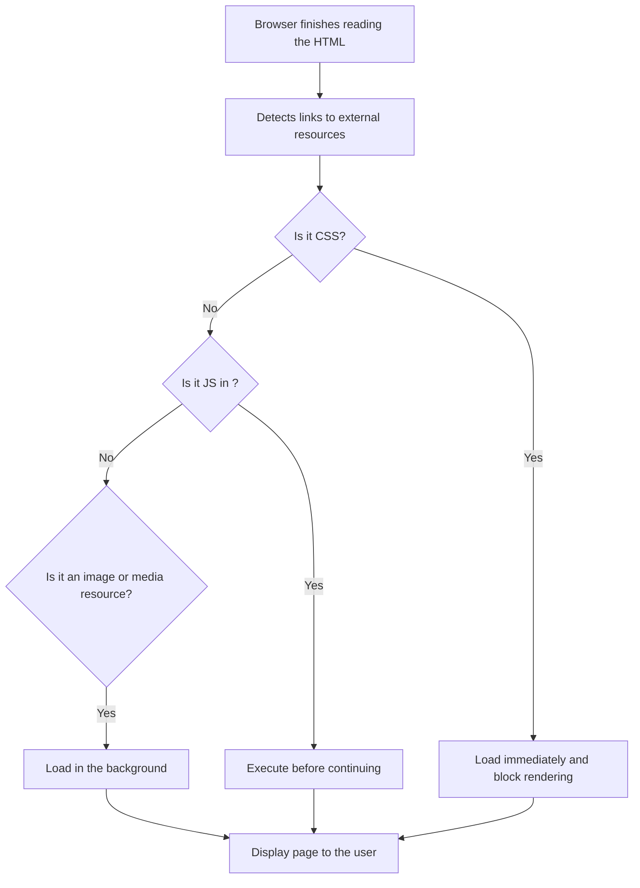

This lesson is not about [parsing HTML](#parsing-the-html.md) or the visual rendering of a website. Here, we focus specifically on **how the browser manages HTTP requests for external resources** (like stylesheets, images, or scripts) after building the DOM. Understanding this process is **key to diagnosing and optimizing website loading**, especially when performance issues arise.

**We assume you already know**:
- What HTTP is and how basic requests and responses work.
- How HTML is constructed and parsed.

Now we dive deeper: **what happens to all those resources referenced in the HTML?** Does the browser download them all at once? What does it prioritize? What can block rendering? Let’s find out!

Once the browser has finished parsing the HTML and building the DOM, its work is far from over. It now needs to **load all the additional resources** mentioned in the page to make it look and function correctly. These resources include: Stylesheets (CSS), images, JavaScript scripts, custom fonts, videos, or other media files.

The question is, does it load them all at once? What happens if there are too many? This is where **resource prioritization** comes into play. The browser detects various tags in the HTML that indicate external resources:

- `<link>` → CSS
- `` → images
- `<script>` → JavaScript
- `<video>`, `<audio>`, `<source>` → media
- `@font-face` → custom fonts

Each of these resources requires an **additional request** to be downloaded. But the browser doesn’t do this in any order—it **prioritizes what is essential to display the page correctly**.

### What Loads First?

Browsers follow certain priority rules:

1. **CSS first:** Stylesheets block page rendering because they affect how it looks. The browser won’t display anything until the CSS is ready.

2. **JavaScript after CSS:** Scripts can also block rendering if they are in the `<head>` and don’t use `defer` or `async`.

3. **Images and other visual resources:** These load in the background, once the main content is being processed.

### What Happens After All Resources Are Loaded? The onload Event

When the browser finishes loading all the main resources referenced in the page (HTML, CSS, images, scripts, fonts, etc.), it triggers a very important event: the onload event. This event indicates that the DOM is fully built and all necessary external resources are completely downloaded.

In JavaScript, you can use it like this:

```javascript
window.onload = function() {
    console.log('The entire page has loaded');
    // Safe to manipulate images, applied styles, etc.
};
```
> Note: `onload` is not immediate; it occurs after everything is downloaded, including images and videos.

For this reason, you shouldn’t use `onload` for tasks that need to run as soon as possible (e.g., initializing basic user interaction). Instead, use it for tasks that depend on everything being visible and available.

### What About async and defer?

Before the `onload` event occurs, browsers already intelligently handle when to load and execute JavaScript scripts.

- `async`: Downloads the script in parallel and executes it as soon as it’s ready, without waiting for the rest of the HTML. This can make script execution unpredictable.

- `defer`: Downloads the script in parallel but waits until the HTML is fully parsed before executing it, without blocking document parsing.

In other words, `async` and `defer` occur before `onload` and help speed up the initial page construction without affecting the final download of all resources. Understanding `async`, `defer`, and `onload` gives you control over when and how your JavaScript runs in relation to the page loading process.

### Why Does This Priority Matter?

Because it **directly affects page load time**. If the browser waits too long to load a key resource (like blocking CSS or a large script), the user will see a blank screen for longer.

Knowing this allows you to:

- Optimize the order of your HTML code
- Use attributes like `defer`, `async`, `loading="lazy"`
- Improve the loading experience for your users

If we compare this process to a professional kitchen, it would look something like this:

- The chef first heats the pan (CSS).
- Then starts preparing the base ingredients (HTML + visual structure).
- Meanwhile, others bring in secondary ingredients (images, videos, scripts).
- Only when everything is in place, the dish is presented.

The browser works the same way: **it loads the essentials first, and the decorative elements later**.



## Above the Fold vs Below the Fold: Optimizing Perceived Load Time

In the world of web performance, there’s a key concept: **above the fold** and **below the fold**.

- **Above the fold** refers to the part of a webpage that **the user sees immediately** when the page loads, **without scrolling**.
- **Below the fold** refers to everything that **requires scrolling** to be visible.

Why does this distinction matter? Because the browser and developers can prioritize resources that affect **first** the visible part (`above the fold`) to give the impression that the page loads quickly, even if there’s still content downloading below.

### `loading="lazy"` and Its Relationship with the Fold

To improve this behavior, there’s a very useful attribute for images: **`loading="lazy"`**. When we add `loading="lazy"` to an image:

- The browser **does not download the image immediately**.
- **It only downloads** the image when the user **gets close** to it by scrolling.

This is perfect for images that are **below the fold** because it saves initial bandwidth, speeds up the construction of the visible DOM, and reduces the time until the user sees something useful.

```html

```

> **Note:** Images **above the fold** **SHOULD NOT** have `loading="lazy"`, because the user needs to see them right away.

## Should We Separate CSS and JavaScript?

Yes. To achieve faster loading, it’s a good practice to:

- **Separate CSS and JavaScript** that is critical for **above the fold** content.
- Load the rest of the styles and scripts in a deferred manner (`async`, `defer`, or lazy-loaded).

For example:

- **Critical CSS** (for the header, menu, hero image) can be **inlined** or in a small file loaded immediately.
- Secondary scripts (like sliders, pop-ups, analytics) can be deferred or loaded after user interaction.

This strategy helps users see and use the site **much faster**, even if the total page load isn’t complete yet.

### Real Debugging Cases Where Understanding This Helps

These concepts are fundamental for identifying and solving slow-loading issues:

- **Blank screens for several seconds:** Could be due to blocking CSS or critical images with `loading="lazy"` applied incorrectly.

- **High time to first render (low TTFB but blank screen):** Often indicates issues with the loading order of CSS or JavaScript.

- **Frozen or slow scrolling:** Likely caused by too many heavy `below the fold` resources that aren’t optimized or deferred.

- **Visible images appearing late or never:** They might have `loading="lazy"` but are **above the fold** (misuse of lazy-loading).

- **Correct visible rendering but functional failures (buttons, forms):** The JavaScript needed for interaction was deferred or loaded too late.
