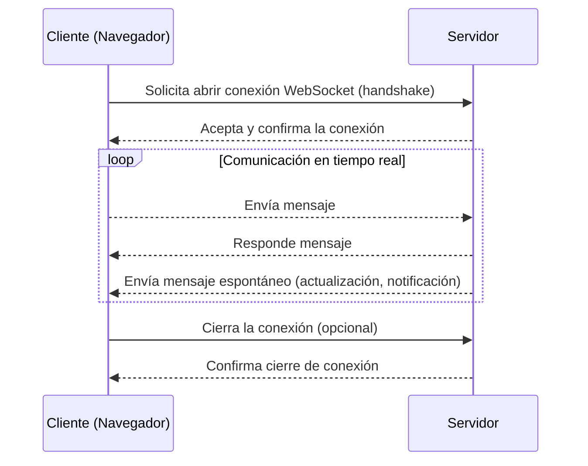

Hasta ahora, sabemos que JavaScript puede hacer solicitudes para traer nuevos datos, pero siempre enviando una nueva petición cada vez. Sin embargo, ¿qué pasa si necesitamos recibir **actualizaciones constantes** en tiempo real, como en un chat en vivo, una partida multijugador o cotizaciones de bolsa? Enviar una nueva solicitud cada vez sería lento e ineficiente.

Aquí es donde entran los **WebSockets**, la cual es una tecnología que permite **mantener una conexión permanente** entre el navegador y el servidor, para intercambiar datos **de manera instantánea**.


### WebSocket explicado fácil: comunicación directa entre navegador y servidor

Un **WebSocket** es como **abrir una línea telefónica directa** entre el navegador y el servidor.

- Se establece **una única conexión** que queda **abierta** mientras la página esté activa.
- A través de esa conexión, **el servidor puede enviar mensajes al cliente en cualquier momento**, sin que el cliente tenga que estar pidiéndolos.
- De la misma manera, el cliente también puede enviar mensajes al servidor instantáneamente.

Así, la comunicación es **bidireccional**, **rápida** y **continua**. Piensa que en HTTP tradicional, cada vez que quieres hablar con alguien, tienes que tocar la puerta, esperar que te abran, decir algo y volver a cerrarla. Con WebSocket, es como si la puerta entre tu y la otra persona estuviera siempre abierta, pueden hablarse, gritarse o pasarse notas en cualquier momento, sin interrupciones ni protocolos de apertura y cierre.




Ejemplos donde se usan WebSockets:

- **Chats en vivo** (como WhatsApp Web, Messenger, Slack).
- **Videojuegos online** que requieren comunicación en tiempo real.
- **Actualizaciones de cotizaciones bursátiles** o precios de criptomonedas.
- **Aplicaciones de colaboración** como Google Docs o Figma.
- **Notificaciones en tiempo real** (por ejemplo, nuevas reacciones, nuevos mensajes).


### Diferencias clave respecto a HTTP tradicional

| HTTP Tradicional | WebSocket |
|:-----------------|:----------|
| Cada solicitud abre y cierra una conexión nueva. | La conexión se mantiene abierta todo el tiempo. |
| El cliente siempre inicia la comunicación. | Cliente y servidor pueden enviar mensajes en cualquier momento. |
| Bueno para cargas ocasionales de datos. | Ideal para actualizaciones constantes y rápidas. |


### ¿Cómo se establece una conexión WebSocket?

Ahora que entendemos qué es un WebSocket y en qué se diferencia del modelo tradicional basado en HTTP, vale la pena ver **cómo se pone en práctica**. En JavaScript, establecer una conexión WebSocket es sorprendentemente sencillo. Solo necesitas crear un nuevo objeto `WebSocket`, pasándole la URL del servidor que acepte conexiones WebSocket (generalmente comenzando con `ws://` o `wss://` para conexiones seguras).

Un ejemplo básico sería:

```javascript
const socket = new WebSocket('wss://servidor-ejemplo.com');

socket.onopen = () => {
  console.log('Conexión abierta');
};

socket.onmessage = (event) => {
  console.log('Mensaje recibido:', event.data);
};

socket.onclose = () => {
  console.log('Conexión cerrada');
};
```
Así, creamos una conexión persistente donde tanto el navegador como el servidor pueden enviarse datos en tiempo real, sin necesidad de repetir solicitudes.

> **Nota:** Aunque no es necesario que aprendas en detalle cada uno de estos métodos ahora mismo, es importante que entiendas que WebSocket es parte del propio JavaScript, no necesitas instalar librerías adicionales para utilizarlo.

#### ¿Qué diferencia hay entre ws:// y wss://?

Cuando establecemos una conexión WebSocket:

- `ws://` es una conexión sin cifrar, similar a `http://`.

- `wss://` es una conexión segura y cifrada, similar a `https://`.

Hoy en día, casi todos los servidores modernos utilizan `wss://` para proteger la información que viaja entre el navegador y el servidor, garantizando seguridad y privacidad en la comunicación.

Es importante que sepas que aunque los WebSockets son ideales para comunicaciones en tiempo real, no reemplazan al protocolo [**HTTP**](https://4geeks.com/es/lesson/que-es-http?search=http) en general. HTTP sigue siendo el estándar principal para tareas como cargar páginas web, enviar formularios o acceder a archivos estáticos. Los WebSockets son una herramienta complementaria que se utiliza cuando se necesita actualización constante y bidireccional entre cliente y servidor.


## ¿Dominas la comunicación instantánea? ¡Ponte a prueba! 😎

Ahora que conoces cómo funciona WebSocket y su poder para mantener conexiones en tiempo real, es momento de poner a prueba lo que aprendiste. Marca las respuestas correctas para cada pregunta:


**¿Cuál es la principal ventaja de usar WebSockets frente a solicitudes HTTP tradicionales?**
- [ ] Aumentar el peso de las páginas.
- [ ] Mantener una conexión abierta y enviar/recibir datos en cualquier momento.
- [ ] Hacer más solicitudes simultáneas.
- [ ] Reemplazar completamente al protocolo HTTP.


**¿Qué protocolo indica que una conexión WebSocket es segura y cifrada?**
- [ ] ws://
- [ ] wss://
- [ ] https://
- [ ] secure-websocket://


**¿Qué sucede si el servidor tiene nueva información para el cliente durante una conexión WebSocket?**
- [ ] Debe esperar a que el cliente haga una nueva solicitud.
- [ ] Puede enviarla inmediatamente, sin necesidad de que el cliente la pida.
- [ ] No puede enviar información nueva hasta que el cliente pregunte.
- [ ] Debe cerrar y abrir una nueva conexión.

**¿En qué situaciones es más recomendable usar WebSocket?**
- [ ] Para cargar una página HTML estática.
- [ ] Para descargar imágenes de un sitio web.
- [ ] Para aplicaciones que requieren actualizaciones constantes y en tiempo real.
- [ ] Para enviar formularios de contacto.


**¿Qué evento de WebSocket en JavaScript se utiliza para recibir un mensaje del servidor?**
- [ ] `onopen`
- [ ] `onmessage`
- [ ] `onerror`
- [ ] `onclose`


### Soluciones:

1. ✅ Mantener una conexión abierta y enviar/recibir datos en cualquier momento.  
2. ✅ wss://  
3. ✅ Puede enviarla inmediatamente, sin necesidad de que el cliente la pida.  
4. ✅ Para aplicaciones que requieren actualizaciones constantes y en tiempo real.  
5. ✅ `onmessage`

