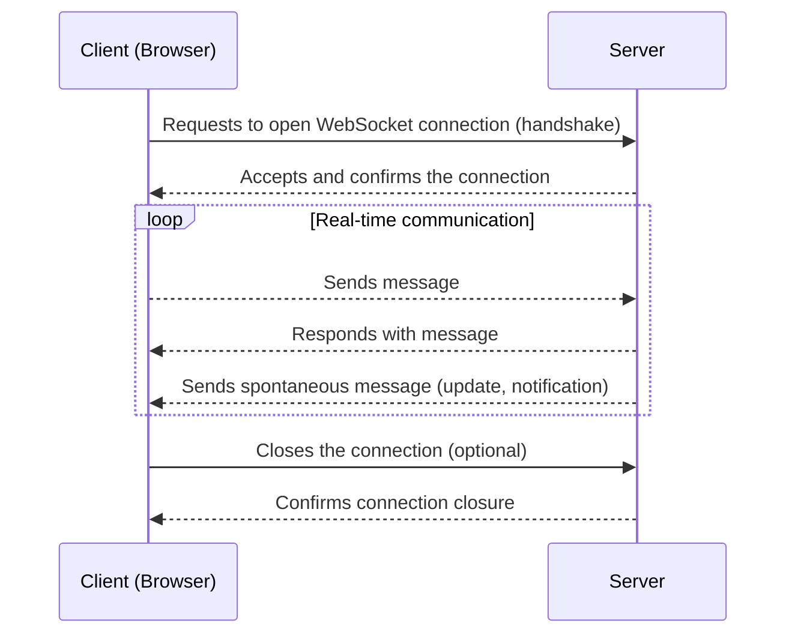

So far, we know that JavaScript can make requests to fetch new data, but it always sends a new request each time. However, what happens if we need to receive **constant real-time updates**, like in a live chat, a multiplayer game, or stock quotes? Sending a new request every time would be slow and inefficient.

This is where **WebSockets** come in, a technology that allows **maintaining a permanent connection** between the browser and the server to exchange data **instantly**.


### WebSocket Explained Simply: Direct Communication Between Browser and Server

A **WebSocket** is like **opening a direct phone line** between the browser and the server.

- A **single connection** is established and remains **open** as long as the page is active.
- Through this connection, **the server can send messages to the client at any time**, without the client having to request them.
- Similarly, the client can also send messages to the server instantly.

Thus, the communication is **bidirectional**, **fast**, and **continuous**. Think of traditional HTTP as knocking on a door every time you want to talk to someone, waiting for them to open, saying something, and then closing the door again. With WebSocket, it's like the door between you and the other person is always open, allowing you to talk, shout, or pass notes at any time without interruptions or door-opening protocols.




Examples where WebSockets are used:

- **Live chats** (like WhatsApp Web, Messenger, Slack).
- **Online games** requiring real-time communication.
- **Stock market updates** or cryptocurrency prices.
- **Collaboration applications** like Google Docs or Figma.
- **Real-time notifications** (e.g., new reactions, new messages).


### Key Differences Compared to Traditional HTTP

| Traditional HTTP | WebSocket |
|:-----------------|:----------|
| Each request opens and closes a new connection. | The connection remains open all the time. |
| The client always initiates communication. | Both client and server can send messages at any time. |
| Good for occasional data loads. | Ideal for constant and fast updates. |


### How is a WebSocket Connection Established?

Now that we understand what a WebSocket is and how it differs from the traditional HTTP-based model, it's worth seeing **how to implement it**. In JavaScript, establishing a WebSocket connection is surprisingly simple. You just need to create a new `WebSocket` object, passing it the URL of the server that accepts WebSocket connections (usually starting with `ws://` or `wss://` for secure connections).

A basic example would be:

```javascript
const socket = new WebSocket('wss://example-server.com');

socket.onopen = () => {
    console.log('Connection opened');
};

socket.onmessage = (event) => {
    console.log('Message received:', event.data);
};

socket.onclose = () => {
    console.log('Connection closed');
};
```
This creates a persistent connection where both the browser and the server can send data to each other in real-time without needing to repeat requests.

> **Note:** While you don't need to learn every method in detail right now, it's important to understand that WebSocket is part of JavaScript itself, and you don't need to install additional libraries to use it.

#### What is the Difference Between ws:// and wss://?

When establishing a WebSocket connection:

- `ws://` is an unencrypted connection, similar to `http://`.

- `wss://` is a secure and encrypted connection, similar to `https://`.

Nowadays, almost all modern servers use `wss://` to protect the information traveling between the browser and the server, ensuring security and privacy in communication.

It's important to note that while WebSockets are ideal for real-time communications, they do not replace the [**HTTP**](https://4geeks.com/es/lesson/que-es-http?search=http) protocol in general. HTTP remains the primary standard for tasks like loading web pages, submitting forms, or accessing static files. WebSockets are a complementary tool used when constant and bidirectional updates between client and server are needed.


## Do You Master Instant Communication? Test Yourself! 😎

Now that you know how WebSocket works and its power to maintain real-time connections, it's time to test what you've learned. Mark the correct answers for each question:


**What is the main advantage of using WebSockets over traditional HTTP requests?**
- [ ] Increasing the weight of web pages.
- [ ] Maintaining an open connection and sending/receiving data at any time.
- [ ] Making more simultaneous requests.
- [ ] Completely replacing the HTTP protocol.


**Which protocol indicates that a WebSocket connection is secure and encrypted?**
- [ ] ws://
- [ ] wss://
- [ ] https://
- [ ] secure-websocket://


**What happens if the server has new information for the client during a WebSocket connection?**
- [ ] It must wait for the client to make a new request.
- [ ] It can send it immediately without the client requesting it.
- [ ] It cannot send new information until the client asks.
- [ ] It must close and open a new connection.

**In which situations is it most recommended to use WebSocket?**
- [ ] To load a static HTML page.
- [ ] To download images from a website.
- [ ] For applications requiring constant and real-time updates.
- [ ] To send contact forms.


**Which WebSocket event in JavaScript is used to receive a message from the server?**
- [ ] `onopen`
- [ ] `onmessage`
- [ ] `onerror`
- [ ] `onclose`


### Solutions:

1. ✅ Maintaining an open connection and sending/receiving data at any time.  
2. ✅ wss://  
3. ✅ It can send it immediately without the client requesting it.  
4. ✅ For applications requiring constant and real-time updates.  
5. ✅ `onmessage`
