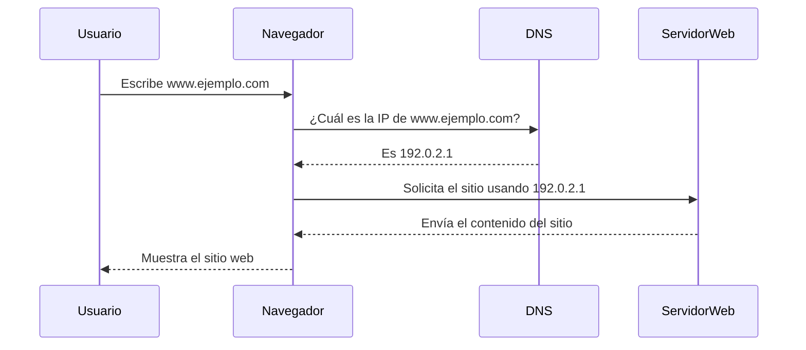

**Imagina que el DNS (Sistema de Nombres de Dominio) es como una guía telefónica de Internet.** 
Cuando escribimos una dirección web como “www.ejemplo.com”, los navegadores no entienden ese nombre como tal. Ellos sólo entienden números, específicamente **direcciones IP** (como "192.0.2.1"). Pero, ¿cómo sabe el navegador qué número corresponde a cada nombre de dominio?

Es aquí donde entra en juego el DNS. Es el sistema que se encarga de **traducir** los nombres de dominio que usamos todos los días (como "www.ejemplo.com") en una dirección numérica que los servidores puedan reconocer y entender. Sin el DNS, tendríamos que recordar las direcciones IP de todos los sitios web que visitamos, lo cual no sería nada práctico.

#### **¿Cómo Funciona en la Práctica?**

Cuando escribes “www.ejemplo.com” en la barra de direcciones de tu navegador, **el navegador hace una consulta al servidor DNS**. Básicamente, le pregunta: "¿Dónde se encuentra www.ejemplo.com?" Y el servidor DNS responde, proporcionando la **dirección IP** asociada con ese nombre de dominio.

Esto es como cuando buscas el número de teléfono de un restaurante en una guía telefónica. Tú sabes el nombre del restaurante, pero para llamarlo necesitas el número. El DNS hace ese trabajo, ayudando al navegador a “llamar” al servidor correcto.

#### **¿Por qué es importante el DNS?**

Sin el DNS, acceder a un sitio web sería un desafío. Tendríamos que recordar direcciones como “192.0.2.1” para cada sitio que queramos visitar, en lugar de escribir algo más fácil de recordar, como “www.ejemplo.com”.

El DNS **hace que Internet sea fácil de usar**. Es como tener un asistente que convierte los nombres que vemos a direcciones numéricas que las computadoras pueden procesar sin problema.

#### **Resumen**

- **El DNS** es como una guía telefónica de Internet.
- **Convierte los nombres de dominio** (como “www.ejemplo.com”) en direcciones IP numéricas que los servidores pueden entender.
- Sin el DNS, tendríamos que recordar **direcciones numéricas** complicadas para acceder a sitios web, lo que sería mucho más difícil.

