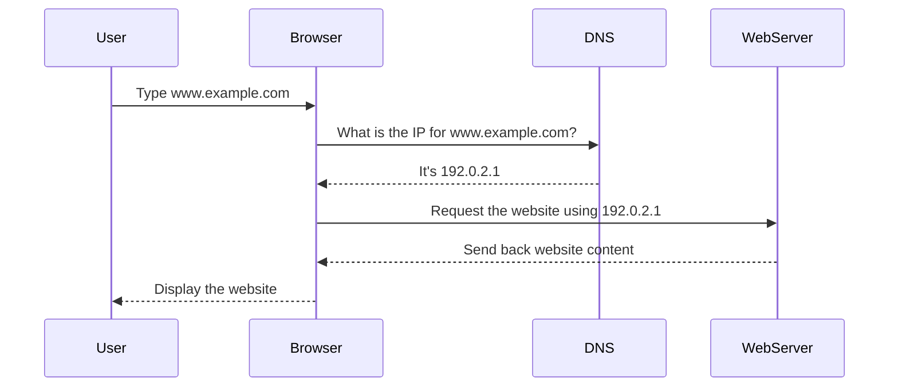

**Imagine DNS (Domain Name System) as the Internet's phonebook.**  
When we type a web address like “www.example.com,” browsers don’t understand that name as is. They only understand numbers, specifically **IP addresses** (like "192.0.2.1"). But how does the browser know which number corresponds to each domain name?

This is where DNS comes into play. It is the system responsible for **translating** the domain names we use every day (like "www.example.com") into a numerical address that servers can recognize and understand. Without DNS, we would have to remember the IP addresses of all the websites we visit, which would be highly impractical.

#### **How Does It Work in Practice?**

When you type “www.example.com” into your browser's address bar, **the browser queries the DNS server**. Essentially, it asks: "Where is www.example.com?" And the DNS server responds by providing the **IP address** associated with that domain name.

This is like looking up a restaurant's phone number in a phonebook. You know the restaurant's name, but to call it, you need the number. DNS does that job, helping the browser “call” the correct server.

#### **Why Is DNS Important?**

Without DNS, accessing a website would be a challenge. We would have to remember addresses like “192.0.2.1” for every site we want to visit, instead of typing something easier to remember, like “www.example.com.”

DNS **makes the Internet user-friendly**. It’s like having an assistant that converts the names we see into numerical addresses that computers can process effortlessly.

#### **Summary**

- **DNS** is like the Internet's phonebook.
- **It converts domain names** (like “www.example.com”) into numerical IP addresses that servers can understand.
- Without DNS, we would have to remember **complex numerical addresses** to access websites, which would be much harder.
