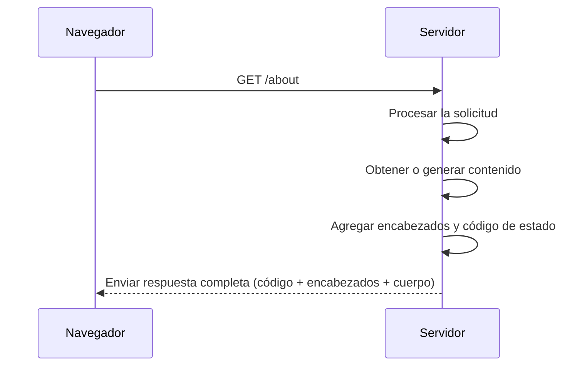

Una vez que el navegador ha enviado una solicitud HTTP a un servidor, comienza una parte fundamental del ciclo web: el momento en el que el servidor **procesa** esa solicitud y **responde** con el contenido adecuado.

Esto no se limita a simplemente devolver un archivo. El servidor tiene que interpretar lo que se le pide, decidir cómo responder y construir esa respuesta adecuadamente. 

### Preparar el contenido: ¿qué va a responder el servidor?

Podemos imaginar al servidor como un chef que recibe un pedido: `la solicitud`. A partir de allí, el servidor tiene que **interpretar lo que se le está pidiendo** y decidir cómo responder. Este paso implica:

1. **Procesar la solicitud**  
   El servidor analiza qué recurso se solicita (por ejemplo, la ruta `/about`) y si tiene la información necesaria para responder.

2. **Obtener el contenido adecuado**  
   - Si es un archivo ya existente (como `about.html`), lo lee directamente del disco.
   - Si la página debe construirse dinámicamente, puede acceder a una base de datos, combinar plantillas, aplicar lógica, etc.

3. **Renderizar la respuesta**  
   Esto puede implicar convertir datos en una página HTML, generar un documento, o preparar una imagen o archivo descargable.

    > Este paso es como un chef en la cocina que recibe una orden y prepara el plato: a veces solo lo saca del horno, y otras lo cocina desde cero.

### Respondiendo al Cliente

Una vez que el contenido está listo, el servidor no lo envía “crudo”, lo acompaña con **instrucciones claras** para que el navegador sepa cómo tratarlo. La respuesta que se le va dar al cliente se compone de tres partes:

1. **Código de estado:** Es un número de tres cifras que indica cómo terminó el procesamiento de la solicitud. 

    - `200 OK`: Todo funcionó correctamente.
    - `404 Not Found`: El recurso solicitado no existe.
    - `500 Internal Server Error`: El servidor tuvo un problema interno.

    Este código es la **primera pista** que recibe el navegador (y los desarrolladores) sobre cómo terminó la solicitud.

2. **Encabezados HTTP:** Son instrucciones adicionales sobre cómo interpretar la respuesta:

    - `Content-Type: text/html`: le indica al navegador que el contenido es HTML.
    - `Content-Length: 1024`: informa cuántos bytes tiene la respuesta.
    - `Cache-Control: no-cache`: dice si el navegador puede guardar la respuesta en caché.

3. **Cuerpo del mensaje:** Es el contenido propiamente dicho, es decir, una página HTML, un archivo, una imagen, etc.

> Este paso es como el camarero que lleva el plato a la mesa, junto con el recibo que explica qué es, para cuántas personas, si es vegetariano, etc.

Una vez que el contenido está listo y acompañado por los encabezados y el código de estado, el servidor **empaqueta todo y lo envía de vuelta al navegador**.

En ese momento, el trabajo del servidor finaliza. Ahora le toca al navegador interpretar la respuesta y mostrarla en pantalla.