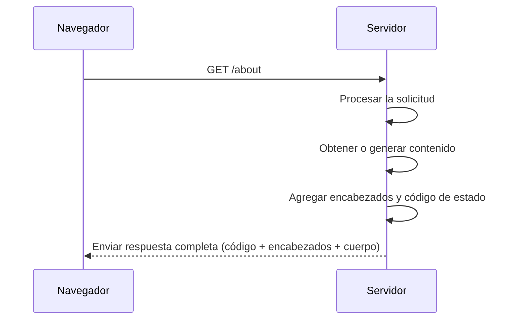

Antes de continuar, tomémonos un momento para entender de qué trata esta parte del proceso. Durante los próximos minutos, vamos a explorar **todo lo que sucede dentro del servidor desde el momento en que recibe una solicitud hasta que envía una respuesta de vuelta al navegador**. Este recorrido es esencial, porque **gran parte del trabajo de desarrollo web y resolución de errores** depende de comprender correctamente estos pasos.

**Asumimos que la solicitud ya fue enviada** (por ejemplo, el navegador pidió `/about`) y partimos desde ahí para descubrir cómo el servidor interpreta ese pedido, construye una respuesta adecuada y la entrega.

¿Listo? Porque entender este flujo es una de las habilidades más importantes para dominar el desarrollo web moderno.

### Prepararando el contenido: ¿Cómo decide el servidor qué responder?

Podemos imaginar al servidor como un chef que recibe un pedido: `la solicitud`. A partir de allí, el servidor tiene que **interpretar lo que se le está pidiendo** y decidir cómo responder. Este paso implica:

1. **Procesar la solicitud**  
   El servidor analiza qué recurso se solicita (por ejemplo, la ruta `/about`) y si tiene la información necesaria para responder.

2. **Obtener el contenido adecuado**  
   - Si es un archivo ya existente (como `about.html`), lo lee directamente del disco.
   - Si la página debe construirse dinámicamente, puede acceder a una base de datos, combinar plantillas, aplicar lógica, etc.

3. **Renderizar la respuesta**  
   Esto puede implicar convertir datos en una página HTML, generar un documento, o preparar una imagen o archivo descargable.

    > Este paso es como un chef en la cocina que recibe una orden y prepara el plato: a veces solo lo saca del horno, y otras lo cocina desde cero.

Una vez que el servidor ha preparado todo, llega el momento de **empacar la respuesta** y **enviarla de vuelta al navegador** que la solicitó. Aquí es donde los encabezados, los códigos de estado y el contenido cobran vida en una respuesta HTTP completa.

### Entregando la respuesta: el servidor envía su paquete

Una vez que el contenido está listo, el servidor no lo envía “crudo”, lo acompaña con **instrucciones claras** para que el navegador sepa cómo tratarlo. La respuesta que se le va dar al cliente se compone de tres partes:

1. **Código de estado:** Es un número de tres cifras que indica cómo terminó el procesamiento de la solicitud. 

    - **200 OK**: Todo funcionó correctamente.
    - **404 Not Found**: El recurso solicitado no existe.
    - **500 Internal Server Error**: El servidor tuvo un problema interno.

    Pero no son los únicos que veremos a diario. Existen muchos códigos comunes que conviene dominar:

    - **301 Moved Permanently**: Redirección permanente a otra URL.
    - **302 Found**: Redirección temporal.
    - **304 Not Modified**: El contenido no cambió; usa la versión almacenada en caché.
    - **400 Bad Request**: Error del cliente (por ejemplo, formato incorrecto).
    - **401 Unauthorized**: No autenticado (falta token o credenciales).
    - **403 Forbidden**: Autenticado pero sin permisos.
    - **429 Too Many Requests**: Demasiadas solicitudes en poco tiempo.

    > **Nota:** Diferenciar entre **401** y **403** es clave: **401** indica que el usuario no ha iniciado sesión, mientras que **403** significa que está logueado pero no tiene permiso.

2. **Encabezados HTTP:** Son instrucciones adicionales sobre cómo interpretar la respuesta:

    - `Content-Type: text/html`: le indica al navegador que el contenido es HTML.
    - `Content-Length: 1024`: informa cuántos bytes tiene la respuesta.
    - `Cache-Control: no-cache`: dice si el navegador puede guardar la respuesta en caché.

3. **Cuerpo del mensaje:** Es el contenido propiamente dicho, es decir, una página HTML, un archivo, una imagen, etc.

> Este paso es como el camarero que lleva el plato a la mesa, junto con el recibo que explica qué es, para cuántas personas, si es vegetariano, etc.

### Detectando problemas de caché con el código de estado

A veces, un problema que parece del servidor o del navegador es culpa de la [caché](#optimizing-page-loading). Cuando un servidor responde con `304 Not Modified`, le está diciendo al navegador: "No te mando el contenido de nuevo porque ya lo tienes guardado."Esto es eficiente, pero puede causar problemas si:

- Actualizaste tu página y el navegador sigue mostrando la versión vieja.

- Modificaste datos en una API pero la respuesta sigue igual.

> ⚠️ Atención: Si ves muchos 304 cuando esperas cambios, probablemente la [caché](#optimizing-page-loading) esté interfiriendo.

#### ¿Cómo solucionarlo?

- Vaciar manualmente la caché del navegador.
- Cambiar configuraciones de los encabezados HTTP `Cache-Control: no-cache`.
- Añadir parámetros de versión a las URLs (`/style.css?v=2`).

Ahora bien, una vez que el contenido está listo, empaquetado y enviado, el trabajo del servidor termina.
Ahora el navegador toma la respuesta y la interpreta para mostrarla al usuario en pantalla.

Dominar este flujo completo **desde la solicitud hasta la respuesta** es esencial para diagnosticar errores, optimizar el rendimiento y construir aplicaciones web modernas más robustas.
