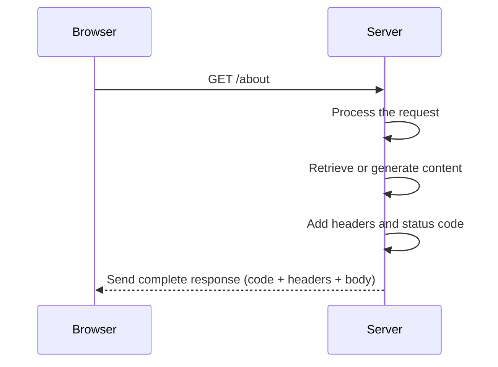

Once the browser has sent an HTTP request to a server, a crucial part of the web cycle begins: the moment when the server **processes** that request and **responds** with the appropriate content.

This is not limited to simply returning a file. The server must interpret what is being requested, decide how to respond, and construct that response properly.

### Preparing the Content: What Will the Server Respond With?

We can imagine the server as a chef receiving an order: `the request`. From there, the server must **interpret what is being asked** and decide how to respond. This step involves:

1. **Processing the request**  
     The server analyzes which resource is being requested (e.g., the `/about` route) and whether it has the necessary information to respond.

2. **Retrieving the appropriate content**  
     - If it’s an existing file (like `about.html`), it reads it directly from the disk.
     - If the page needs to be dynamically generated, it may access a database, combine templates, apply logic, etc.

3. **Rendering the response**  
     This may involve converting data into an HTML page, generating a document, or preparing an image or downloadable file.

    > This step is like a chef in the kitchen receiving an order and preparing the dish: sometimes it’s just taken out of the oven, and other times it’s cooked from scratch.

### Responding to the Client

Once the content is ready, the server doesn’t send it “raw”; it accompanies it with **clear instructions** so the browser knows how to handle it. The response sent to the client consists of three parts:

1. **Status code:** A three-digit number indicating how the request was processed.

    - `200 OK`: Everything worked correctly.
    - `404 Not Found`: The requested resource does not exist.
    - `500 Internal Server Error`: The server encountered an internal problem.

    This code is the **first clue** the browser (and developers) receive about how the request was handled.

2. **HTTP headers:** Additional instructions on how to interpret the response:

    - `Content-Type: text/html`: Tells the browser the content is HTML.
    - `Content-Length: 1024`: Indicates how many bytes the response contains.
    - `Cache-Control: no-cache`: Specifies whether the browser can cache the response.

3. **Message body:** This is the actual content, such as an HTML page, a file, an image, etc.

> This step is like a waiter bringing the dish to the table, along with the receipt explaining what it is, how many servings it’s for, whether it’s vegetarian, etc.

Once the content is ready and accompanied by headers and the status code, the server **packages everything and sends it back to the browser**.

At that point, the server’s job is done. Now it’s up to the browser to interpret the response and display it on the screen.
