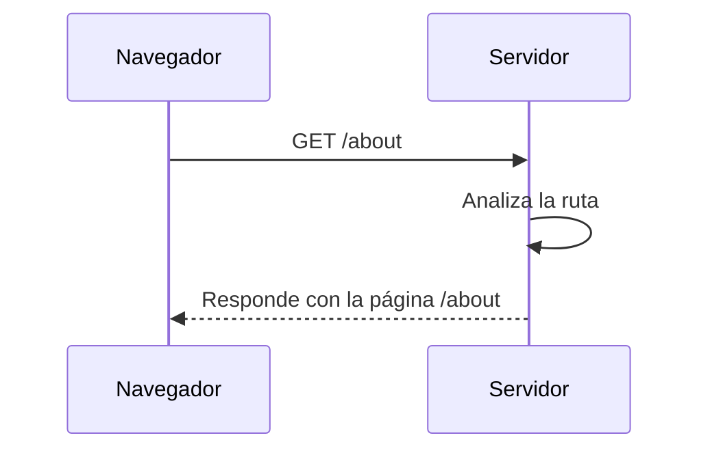

Antes de poder enviar una solicitud a un servidor y recibir una respuesta, es importante entender cómo funcionan las conexiones en Internet. Normalmente, los servidores existen para responder a las solicitudes de otros clientes. Por ejemplo, alguien que en alguna parte del mundo intenta acceder a un sitio web como `www.ejemplo.com`. Sin embargo, los servidores no entienden nombres como `ejemplo.com` directamente solo entienden direcciones IP numéricas. 

Por eso, los navegadores primero utilizan un sistema llamado [**DNS**](#todo) para encontrar la IP correspondiente al nombre de dominio. Una vez que obtienen la dirección IP correcta, recién entonces pueden **enviar la solicitud al servidor adecuado**.


## ¿A qué puerta vamos?

Una vez que el navegador tiene la dirección IP del servidor (gracias al DNS), envía una **solicitud HTTP** para acceder a un recurso específico. Por ejemplo, si el usuario escribe:

```text
https://www.ejemplo.com/about`
```
El navegador se conecta con el servidor de `www.ejemplo.com` y le dice: “Hola, quiero ver la página `/about`”

Aquí entra en juego el **enrutador del servidor**, que analiza la URL y decide **qué recurso entregar**. Es como un recepcionista que escucha tu pedido y te dirige al departamento adecuado:

- `/about` → Página de información
- `/contact` → Formulario de contacto
- `/productos` → Catálogo

Si la ruta no existe, el servidor responde con algo como:

```text
404 Not Found - ¡Ese recurso no fue encontrado!
```

Imagina una tienda con muchos departamentos, cuando haces un pedido (“Quiero ver los productos”), el sistema tiene que llevar tu solicitud al **estante correcto**. Si no hay tal estante, te dicen: “No lo tenemos”.




Comprender el enrutamiento es clave para entender cómo los sitios web organizan su contenido y cómo los servidores responden de forma inteligente a cada visita. Es como tener un buen sistema de atención al cliente, sabiendo a qué mostrador dirigir cada pedido, o cómo responder si algo no se encuentra disponible.

Ahora bien, podrías estar preguntándote **¿Cómo sabe realmente el servidor dónde encontrar la página o el archivo que solicitaste?**. Esto nos lleva a un ejemplo clásico en el mundo real de los servidores: **Apache**, uno de los servidores web más utilizados a nivel mundial.

### Apache: El maestro del mapeo de rutas

En el mundo de los servidores web, **Apache** es considerado el **rey de las rutas** debido a que no inventa rutas nuevas ni depende de configuraciones complicadas, **simplemente toma los paths que ya existen en el sistema operativo** (las carpetas y archivos reales en el disco duro) y **los expone directamente a Internet** como rutas accesibles.

Cuando configuras un servidor Apache, cada carpeta y cada archivo que tienes en tu servidor se convierte automáticamente en una ruta web que los navegadores pueden solicitar. Por ejemplo:

| Carpeta real en el servidor | URL disponible en Internet |
|:----------------------------|:----------------------------|
| `/var/www/html/index.html` | `https://www.example.com/index.html` |
| `/var/www/html/images/logo.png` | `https://www.example.com/images/logo.png` |
| `/var/www/html/css/styles.css` | `https://www.example.com/css/styles.css` |

Así, **apache da consistencia** entre los **paths físicos** en el sistema operativo y las **rutas públicas** que entienden los navegadores. **Esta capacidad de "mapear" de forma ordenada** es lo que hizo de Apache uno de los servidores más exitosos, porque convierte una estructura interna de carpetas en una estructura web organizada y navegable.


### De rutas simples a APIs modernas

El principio de enrutar solicitudes no se limita solo a páginas web tradicionales, sino que es la base del funcionamiento de las [APIs](https://4geeks.com/es/lesson/comprendiendo-rest-apis?search=api). 

Una API (Interfaz de Programación de Aplicaciones) es esencialmente un conjunto de rutas que están conectadas a funciones de código que devuelven datos o ejecutan acciones específicas. Así como antes solicitábamos `/about` o `/contact` para páginas web, ahora solicitamos rutas **pensadas para intercambiar datos** en vez de solo mostrar contenido.


#### ¿Cómo se organizan todas esas rutas?

Al principio, cuando los sistemas eran pequeños, **cada programador inventaba sus propias rutas** de manera improvisada. Era común encontrar URLs como:

- `/obtenerTodosLosUsuarios`
- `/buscarProductosDisponibles`
- `/insertarPedidoNuevo`

Cada nombre era diferente, largo, inconsistente y dependía del gusto personal de quien escribía el servidor. **Esto generaba un problema**, los clientes (navegadores, apps móviles, otros sistemas) no sabían fácilmente cómo interactuar con las [APIs](https://4geeks.com/es/lesson/comprendiendo-rest-apis?search=api). Cada servidor era un mundo aparte, y entender una API nueva era como aprender un idioma distinto.

A medida que las aplicaciones crecieron y comenzaron a comunicarse entre sí, **fue evidente la necesidad de un estándar** que organizara mejor las rutas, hiciera que sean más predecibles, redujera la confusión y mejorara la comunicación entre cliente y servidor. Así nació un estilo de diseño llamado [**REST** (*Representational State Transfer*)](https://4geeks.com/es/lesson/comprendiendo-rest-apis), el cual propone **que cada recurso importante** (usuarios, productos, pedidos, etc.) **tenga su propia ruta clara y consistente** y **que las operaciones** (consultar, crear, modificar o eliminar) **no estén en el nombre de la URL**, sino que **se indiquen usando métodos HTTP estándar**. A continuación, te mostramos los principales métodos y ejemplos de uso:
:


| Método HTTP |         Acción                | Ejemplo de uso                          |
|:------------|:------------------------------|:----------------------------------------|
| GET         | Consultar información         | `GET /usuarios` (listar usuarios)        |
| POST        | Crear un nuevo recurso        | `POST /productos` (agregar un nuevo producto) |
| PUT         | Modificar un recurso existente | `PUT /usuarios/1` (editar usuario con ID 1) |
| DELETE      | Eliminar un recurso           | `DELETE /pedidos/42` (eliminar pedido con ID 42) |


Así, en lugar de inventar nombres raros para las URLs, se utiliza siempre la misma ruta (`/usuarios`) y se cambia el método HTTP según la acción que se quiere hacer. **REST trajo orden y coherencia**, haciendo que APIs de distintos desarrolladores pudieran seguir las mismas reglas y volverse mucho más fáciles de usar.


En conclusión, entender el enrutamiento en un servidor web es fundamental para comprender cómo funciona realmente Internet detrás de escena. Desde la sencilla idea de buscar un archivo en una carpeta hasta la construcción de modernas APIs organizadas con REST, **todo gira en torno a mapear rutas de manera coherente y eficiente**.

Servidores como **Apache** nos enseñaron a respetar y aprovechar las estructuras de archivos reales, mientras que estilos de diseño como **REST** llevaron ese concepto aún más lejos, aplicándolo a la organización de recursos de datos en APIs dinámicas. Al final del día, **cada clic que haces en un sitio web**, cada búsqueda, cada interacción, es un pequeño viaje a través de rutas bien definidas que permiten que todo funcione de manera fluida.  
**Comprender este proceso no solo te acerca a ser un mejor desarrollador, sino también a ver la web como una estructura lógica, viva y cuidadosamente diseñada.**


