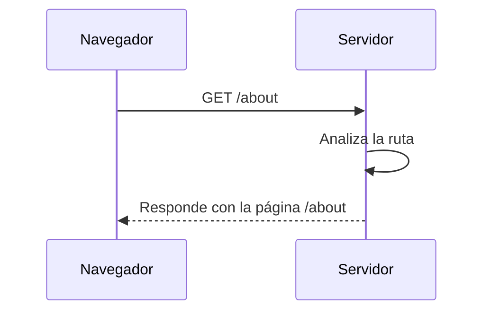

## ¿A qué puerta vamos?

Una vez que el navegador tiene la dirección IP del servidor (gracias al DNS), envía una **solicitud HTTP** para acceder a un recurso específico. Por ejemplo, si el usuario escribe:

```text
https://www.ejemplo.com/about`
```
El navegador se conecta con el servidor de `www.ejemplo.com` y le dice: “Hola, quiero ver la página `/about`”

Aquí entra en juego el **enrutador del servidor**, que analiza la URL y decide **qué recurso entregar**. Es como un recepcionista que escucha tu pedido y te dirige al departamento adecuado:

- `/about` → Página de información
- `/contact` → Formulario de contacto
- `/productos` → Catálogo

Si la ruta no existe, el servidor responde con algo como:

```text
404 Not Found - ¡Ese recurso no fue encontrado!
```

Imagina una tienda con muchos departamentos, cuando haces un pedido (“Quiero ver los productos”), el sistema tiene que llevar tu solicitud al **estante correcto**. Si no hay tal estante, te dicen: “No lo tenemos”.




Comprender el enrutamiento es clave para entender cómo los sitios web organizan su contenido y cómo los servidores responden de forma inteligente a cada visita. Es como tener un buen sistema de atención al cliente, sabiendo a qué mostrador dirigir cada pedido, o cómo responder si algo no se encuentra disponible.