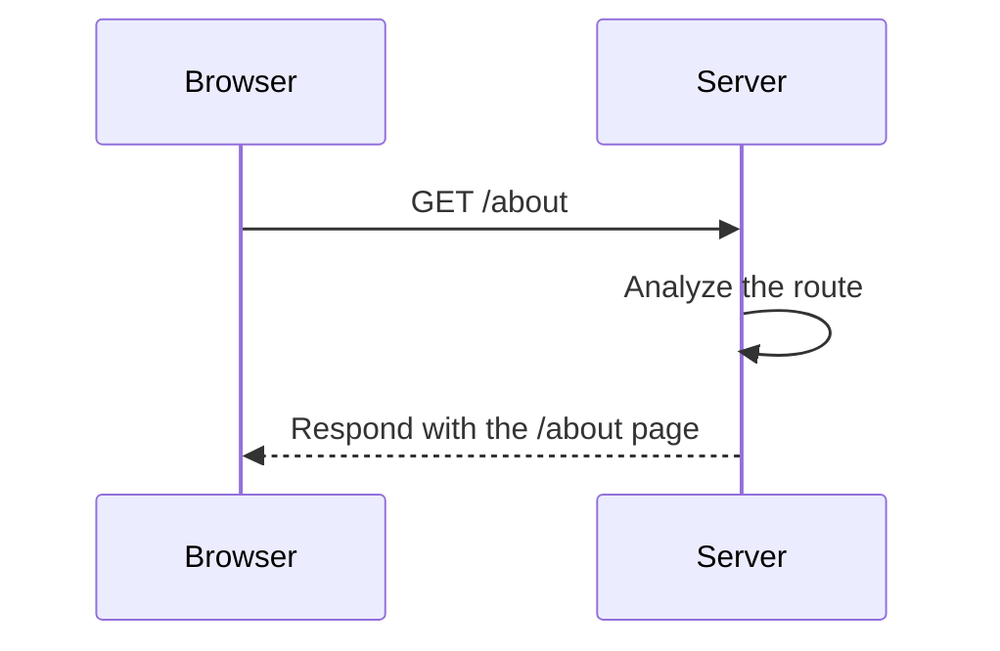

Before sending a request to a server and receiving a response, it's important to understand how internet connections work. Typically, servers exist to respond to requests from clients. For example, someone somewhere in the world tries to access a website like `www.example.com`. However, servers don't understand names like `example.com` directly; they only understand numerical IP addresses.

That's why browsers first use a system called [**DNS**](#) to find the IP corresponding to the domain name. Once they obtain the correct IP address, only then can they **send the request to the appropriate server**.

## Which Door Do We Knock On?

Once the browser has the server's IP address (thanks to DNS), it sends an **HTTP request** to access a specific resource. For example, if the user types:

```text
https://www.example.com/about
```

The browser connects to the server at `www.example.com` and says: "Hello, I want to see the `/about` page."

This is where the **server router** comes into play, analyzing the URL and deciding **which resource to deliver**. It's like a receptionist who listens to your request and directs you to the appropriate department:

- `/about` → Information page
- `/contact` → Contact form
- `/products` → Catalog

If the route doesn't exist, the server responds with something like:

```text
404 Not Found - That resource was not found!
```

Imagine a store with many departments. When you make a request ("I want to see the products"), the system has to take your request to the **correct shelf**. If there's no such shelf, they tell you: "We don't have it."



Understanding routing is key to understanding how websites organize their content and how servers intelligently respond to each visit. It's like having a good customer service system, knowing which counter to direct each request to, or how to respond if something isn't available.

Now, you might be wondering, **"How does the server actually know where to find the page or file you requested?"** This brings us to a classic example in the world of servers: **Apache**, one of the most widely used web servers globally.

### Apache: The Master of Route Mapping

In the world of web servers, **Apache** is considered the **king of routes** because it doesn't invent new routes or rely on complicated configurations. **It simply takes the paths that already exist in the operating system** (the real folders and files on the hard drive) and **exposes them directly to the internet** as accessible routes.

When you configure an Apache server, every folder and file on your server automatically becomes a web route that browsers can request. For example:

| Real folder on the server | URL available on the internet |
|:--------------------------|:------------------------------|
| `/var/www/html/index.html` | `https://www.example.com/index.html` |
| `/var/www/html/images/logo.png` | `https://www.example.com/images/logo.png` |
| `/var/www/html/css/styles.css` | `https://www.example.com/css/styles.css` |

Thus, **Apache provides consistency** between the **physical paths** in the operating system and the **public routes** understood by browsers. **This ability to "map" in an orderly way** is what made Apache one of the most successful servers, as it turns an internal folder structure into an organized and navigable web structure.

### From Simple Routes to Modern APIs

The principle of routing requests isn't limited to traditional web pages; it's also the foundation of how [APIs](https://4geeks.com/en/lesson/understanding-rest-apis?search=api) work.

An API (Application Programming Interface) is essentially a set of routes connected to code functions that return data or perform specific actions. Just as we previously requested `/about` or `/contact` for web pages, now we request routes **designed to exchange data** instead of just displaying content.

#### How Are All These Routes Organized?

Initially, when systems were small, **each programmer invented their own routes** in an improvised way. It was common to find URLs like:

- `/getAllUsers`
- `/searchAvailableProducts`
- `/insertNewOrder`

Each name was different, long, inconsistent, and depended on the personal preference of whoever wrote the server. **This created a problem**: clients (browsers, mobile apps, other systems) couldn't easily figure out how to interact with the [APIs](https://4geeks.com/en/lesson/understanding-rest-apis?search=api). Each server was a separate world, and understanding a new API was like learning a different language.

As applications grew and began to communicate with each other, **the need for a standard** became evident to better organize routes, make them more predictable, reduce confusion, and improve communication between client and server. This led to the creation of a design style called [**REST** (*Representational State Transfer*)](https://4geeks.com/en/lesson/understanding-rest-apis), which proposes **that each important resource** (users, products, orders, etc.) **have its own clear and consistent route** and **that operations** (retrieve, create, update, or delete) **are not in the URL name** but **indicated using standard HTTP methods**. Below are the main methods and usage examples:

| HTTP Method | Action                        | Usage Example                           |
|:------------|:------------------------------|:----------------------------------------|
| GET         | Retrieve information          | `GET /users` (list users)               |
| POST        | Create a new resource         | `POST /products` (add a new product)    |
| PUT         | Update an existing resource   | `PUT /users/1` (edit user with ID 1)    |
| DELETE      | Delete a resource             | `DELETE /orders/42` (delete order with ID 42) |

Thus, instead of inventing strange names for URLs, the same route (`/users`) is always used, and the HTTP method changes depending on the action to be performed. **REST brought order and consistency**, making APIs from different developers follow the same rules and become much easier to use.

In conclusion, understanding server routing is fundamental to understanding how the internet really works behind the scenes. From the simple idea of finding a file in a folder to building modern APIs organized with REST, **everything revolves around mapping routes coherently and efficiently**.

Servers like **Apache** taught us to respect and leverage real file structures, while design styles like **REST** took that concept even further, applying it to the organization of data resources in dynamic APIs. At the end of the day, **every click you make on a website**, every search, every interaction, is a small journey through well-defined routes that make everything work smoothly.  
**Understanding this process not only brings you closer to becoming a better developer but also helps you see the web as a logical, living, and carefully designed structure.**
