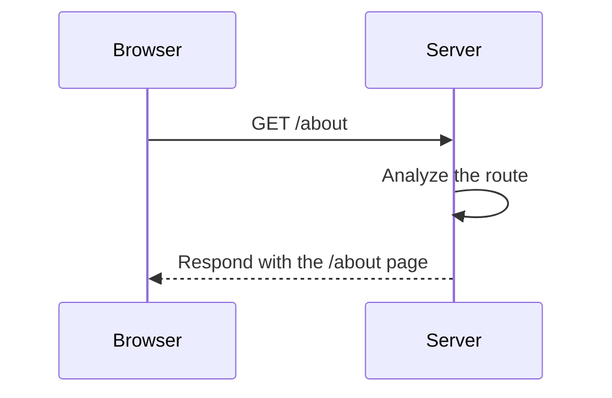

## Which Door Do We Go To?

Once the browser has the server's IP address (thanks to DNS), it sends an **HTTP request** to access a specific resource. For example, if the user types:

```text
https://www.example.com/about
```
The browser connects to the server at `www.example.com` and says: “Hello, I want to see the `/about` page.”

This is where the **server router** comes into play, analyzing the URL and deciding **which resource to deliver**. It's like a receptionist who listens to your request and directs you to the appropriate department:

- `/about` → Information page
- `/contact` → Contact form
- `/products` → Catalog

If the route doesn't exist, the server responds with something like:

```text
404 Not Found - That resource was not found!
```

Imagine a store with many departments. When you make a request (“I want to see the products”), the system has to take your request to the **correct shelf**. If such a shelf doesn't exist, they tell you: “We don't have that.”



Understanding routing is key to knowing how websites organize their content and how servers intelligently respond to each visit. It's like having a good customer service system, knowing which counter to direct each request to, or how to respond if something is unavailable.
