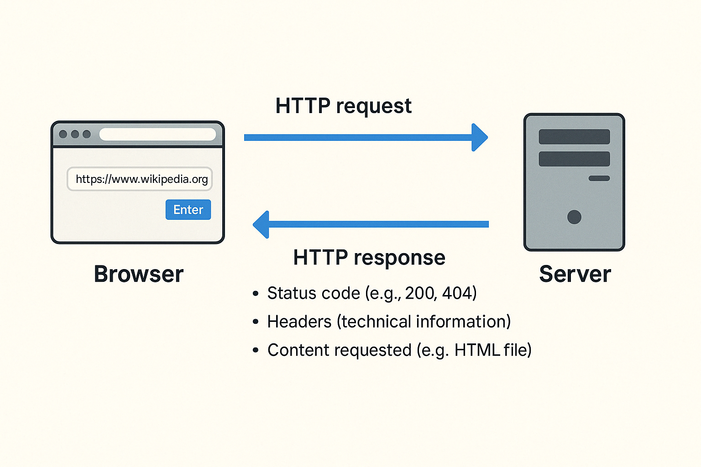

## Introducción a HTTP

HTTP significa **HyperText Transfer Protocol** (Protocolo de Transferencia de Hipertexto). HTTP es un protocolo, es decir, un conjunto de reglas que permite que los navegadores y los servidores se comuniquen eficazmente estableciendo cómo se pide algo, cómo se responde, y cómo debe lucir esa estructura de intercambio (request + response). Aunque suele pasar desapercibido, es el mecanismo central detrás de cada interacción en la web.

Cuando escribes una dirección web (como `https://www.wikipedia.org`) y presionas `Enter`:

1. Tu navegador envía una **solicitud HTTP (HTTP request)** al servidor que aloja esa página.
2. El servidor procesa la solicitud y responde con una **respuesta HTTP (HTTP response)**, que incluye:
   - Un código de estado (como 200, 404, etc.)
   - Encabezados (información técnica)
   - Y, lo más importante, el **contenido solicitado** (por ejemplo, un archivo HTML).

Este ciclo de solicitud/respuesta se repite constantemente mientras navegamos, haciendo que la web funcione en tiempo real.

A continuación, puedes observar el ciclo HTTP en acción: desde que escribes una **URL** hasta que el navegador recibe y procesa la respuesta. El siguiente Imagen muestra cómo usar las herramientas del navegador para ver los detalles técnicos de una solicitud real, en esta demostración:

1. Se accede a `https://example.com`.
2. Se abre el inspector (`F12`) y se selecciona la pestaña `Network`.
3. Al recargar la página, se registra la solicitud.
4. Al hacer clic en `index.html`, se visualizan detalles como:

   - El método de solicitud (GET)
   - El código de estado (200 OK)
   - Los encabezados enviados y recibidos
   - El tipo de contenido (Content-Type: text/html)

Este tipo de inspección es clave para entender cómo fluye la información entre el navegador y el servidor.

### ¿HTTP da formato al contenido?

Aquí es donde aparece una distinción fundamental: **HTTP no interpreta ni da formato al contenido que transporta**. Su función es simplemente **hacer llegar los datos del servidor al navegador** siguiendo reglas precisas de comunicación.

Podemos pensarlo como **un sobre de correo**:

- Define cómo escribir la dirección, cómo embalar el contenido, cómo debe viajar la carta y cómo debe entregarse.
- El contenido puede ser cualquier cosa: una carta de amor, un contrato, una receta o una foto.
- El sobre llega a destino, pero **no modifica lo que hay adentro**, ni intenta entenderlo. Solo lo entrega.

Del mismo modo, HTTP puede transportar:
- Páginas HTML (`text/html`)
- Estilos CSS (`text/css`)
- Scripts JavaScript (`application/javascript`)
- Archivos multimedia (imágenes, videos)
- Datos en formato JSON (`application/json`)

Pero no los interpreta, ni les da estilo, ni los “muestra”. Eso lo hace el navegador, **una vez que recibe el paquete**.

> Por eso decimos que **HTTP “no tiene formato”**: no le importa si está enviando un texto, una imagen o un archivo de datos. Su tarea es entregar la información de forma estructurada y confiable, sin intervenir en su contenido.

### Formatos de contenido aceptados por el navegador

Cuando el navegador recibe una respuesta HTTP, examina el tipo de contenido mediante el **header `Content-Type`** y decide cómo manejarlo. Algunos de los formatos más comunes son:

| Formato | Tipo MIME | Uso |
|--------|-----------|-----|
| `text/html` | HTML | Estructura de una página web |
| `text/css` | CSS | Estilos visuales |
| `application/javascript` | JS | Comportamiento dinámico |
| `application/json` | JSON | Datos estructurados (común en APIs) |
| `image/png`, `image/jpeg` | Imágenes | Representación gráfica |
| `text/plain` | Texto plano | Lectura sin formato |

El navegador **traduce estos datos en una experiencia visual**: renderiza el HTML, aplica los estilos del CSS, ejecuta los scripts JS y muestra imágenes o texto. Así transforma la “carga de datos” en una página funcional e interactiva.

## Glosario rápido:
- **HTTP**: Protocolo de transferencia de hipertexto
- **Petición (Request)**: Petición de un navegador a un servidor
- **Respuesta (Response)**: Respuesta que devuelve el servidor
- **Código de estatus (Status Code)**: Código que indica el estado de la respuesta (200 = OK, 404 = No encontrado)
- **Encabezados (Header)**: Información técnica adicional que acompaña a un request o response

