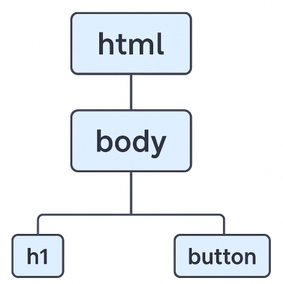

Every time we access a web page, a series of invisible processes occur that transform files into a visual experience. In this lesson, we will first explore the **essential formats** that make a dynamic web page possible, and then examine **what happens behind the scenes** from the moment you type a URL to when the page appears before your eyes.

## The Architecture of a Website

A web page is not a single file but a collection of pieces working together. The three fundamental languages are:

| Language   | Main Function                  | Example                |
|------------|--------------------------------|------------------------|
| **HTML**   | Content structure             | `<h1>Hello world</h1>` |
| **CSS**    | Visual styling                | `color: tomato;`       |
| **JS**     | Dynamism and interactivity    | `button.onclick = ...`|

A great way to understand how these languages work together is to visualize the browser's interpretation flow. Below is an educational simulator with three tabs that demonstrate how HTML, CSS, and JavaScript interact to build a complete web experience:

<iframe src="https://codesandbox.io/embed/pqwdtq?view=preview&module=%2Fsrc%2Findex.html&hidenavigation=1"
         style="width:100%; height: 500px; border:0; border-radius: 4px; overflow:hidden;"
         title="browser-simulator"
         allow="accelerometer; ambient-light-sensor; camera; encrypted-media; geolocation; gyroscope; hid; microphone; midi; payment; usb; vr; xr-spatial-tracking"
         sandbox="allow-forms allow-modals allow-popups allow-presentation allow-same-origin allow-scripts"
     ></iframe>

🔗[View Simulator](https://codesandbox.io/embed/pqwdtq?view=preview&module=%2Fsrc%2Findex.html&hidenavigation=1)

| View                  | Displayed Content                                                                 |
|-----------------------|-----------------------------------------------------------------------------------|
| 🧾 **Plain HTML**      | `<h1>Hello world</h1>` and `<button>Change Title</button>`                       |
| 🧱 **Structured DOM**  | A tree with `<html> → <body> → <h1>` and a `<button>` node                      |
| 🌐 **Rendered Page**   | The visually styled title and an interactive button that modifies the content    |

> 💡 The button is functional: clicking it allows JavaScript to modify the title text, demonstrating how the DOM can dynamically change in real time.

## From URL to Content: The Request Process

Behind a routine action like typing `https://example.com` into the address bar and pressing Enter lies a rigorous technical process that enables the browser to request, receive, and interpret the files needed to display a web page. Below, we detail this journey step by step to understand how a site’s loading truly begins.

1. **Domain Resolution:** The first step is translating the domain name into an IP address. The browser uses the DNS (Domain Name System), which acts as the internet's phonebook, converting human-readable domains (like `example.com`) into machine-readable IP addresses (like `192.0.2.1`). Without this translation, the browser wouldn't know which server to connect to.

2. **Establishing the Connection:** Once the domain is resolved, the browser establishes a connection with the corresponding server. In most cases, this connection uses the HTTPS protocol, ensuring that communication between the client and server is encrypted and secure.

    > 🔐 HTTPS is the secure version of HTTP. It protects the information traveling between your browser and the server.

3. **Sending the HTTP Request:** With the connection established, the browser sends an HTTP request to the server. This request, often of type `GET`, specifies which resource it wants to retrieve, such as `index.html`.

    A typical request looks like this:

    ```http
    GET /index.html HTTP/1.1
    Host: www.example.com
    ```

4. **Server Response:** The server responds with an HTTP message that includes:

    - A status code. Some codes are part of web folklore — like **404 Not Found** — but there are many others, such as **200 OK** (everything went well), **301 Moved Permanently**, or **500 Internal Server Error**, which indicate the result of the request.
    - Headers with technical information about the response.
    - The requested content, such as an HTML file.

    Example response:

    ```http
    HTTP/1.1 200 OK
    Content-Type: text/html


    <html>
        <head>...</head>
        <body>Hello world</body>
    </html>
    ```

5. **Downloading Additional Resources:** After receiving the HTML file, the browser analyzes it and detects other resources needed to build the page: stylesheets (CSS), scripts (JavaScript), images, fonts, and more.

    Each of these files is requested independently from the server, repeating the same cycle: request, response, and interpretation.

## The DOM: A Living Structure

Receiving the files is only half the process. What makes modern browsers special is their ability to interpret these files and build a functional visual experience. When the browser receives the HTML file from the server, its first task is to interpret that content to construct an internal representation called the **DOM (Document Object Model)**.

The DOM is not the HTML itself but a data structure that organizes the document's elements into a hierarchical tree. Each node in the tree represents an element of the page: tags like `<div>`, `<h1>`, `<p>`, as well as attributes, text, and even comments.



This structure is what the browser uses to:

- Render the visual interface the user sees.
- Apply CSS styles to elements.
- Execute interactions defined with JavaScript.

Unlike a static document, the DOM is a **dynamic** structure. It can be modified in real time through JavaScript code or even by the user using tools like the browser's element inspector. For example, a JavaScript function can change a title's text, add new elements, or remove parts of the content without reloading the page.

### Progressive Rendering: How Browsers Prioritize the Experience

The browser doesn't wait to download all the files before displaying something on the screen. As soon as it starts receiving the HTML, it begins constructing the DOM and rendering the first visible elements.

This behavior, known as **progressive rendering**, aims to improve the user experience by reducing perceived wait times. It's common to see a page "build itself" before your eyes: first, the text appears, followed by styles, images, and functionalities.

However, not all resources are equal in this process. Some files can **block rendering** until they are fully downloaded and processed:

- Stylesheets (`<link rel="stylesheet">`) are essential for design. The browser halts visual rendering until these are available, as they directly affect the layout and appearance of elements.
    
- JavaScript scripts (`<script>`) are executed immediately during loading, which pauses DOM construction until they are completed.

This prioritization logic makes it crucial to understand how and when resources are loaded, especially when optimizing a website's speed and loading experience.

#### Why Can't Everything Be Rendered Instantly?

The browser needs to ensure that what it displays is visually coherent and functional. Certain resources influence appearance or behavior so significantly that the browser decides to wait for them to fully load before continuing. These are called **blocking resources**.

| Resource                     | Blocking? | How to Avoid It                        |
|------------------------------|-----------|----------------------------------------|
| `<link rel="stylesheet">`    | Yes       | Minimize, load conditionally           |
| `<script>` without `defer/async` | Yes    | Use `defer` or move to the end of the body |
| Web Fonts (`@font-face`)     | Partial   | Use `font-display: swap`               |

Understanding how a web page is built and loaded allows developers to make better decisions: from how to organize files to how to optimize their loading. What the user sees on the screen is the result of multiple layers collaborating in real time. Mastering these fundamentals is key to building efficient, accessible, and modern experiences.